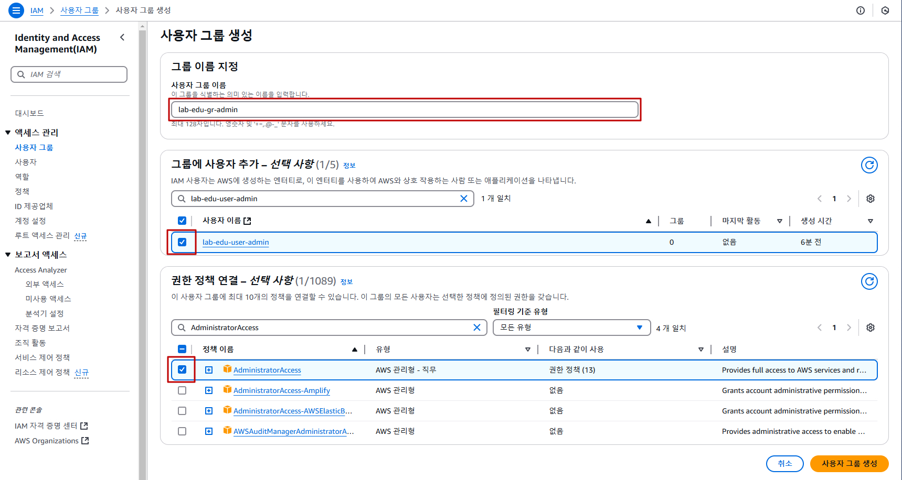

## Table of Contents
- [Table of Contents](#table-of-contents)
- [IAM User \& Group 생성](#iam-user--group-생성)
  - [1. IAM User 생성](#1-iam-user-생성)
  - [2. IAM Group 생성](#2-iam-group-생성)
- [IAM User \& Group 테스트](#iam-user--group-테스트)
  - [1. IAM User 이용 AWS Management Console 접속](#1-iam-user-이용-aws-management-console-접속)
  - [2. IAM User 권한 테스트](#2-iam-user-권한-테스트)

## IAM User & Group 생성

- 아래 생성 정보를 참고해서 IAM Group 및 User 생성

  |        IAM_GROUP         |     IAM_POLICY      |      IAM_USER      |
  | :----------------------: | :-----------------: | :----------------: |
  |     lab-edu-gr-admin     | AdministratorAccess | lab-edu-user-admin |
  |   lab-edu-gr-developer   |   ReadOnlyAccess    |  lab-edu-user-dev  |
  | lab-edu-gr-infra-manager |   PowerUserAccess   | lab-edu-user-infra |

### 1. IAM User 생성

- **IAM 메인 콘솔 화면 → `사용자` 리소스 탭 → `사용자 생성` 버튼 클릭**

- IAM User 생성 정보 입력

  - 이름: lab-edu-user-admin

  - `AWS Management Console에 대한 사용자 액세스 권한 제공` 체크

  - `IAM 사용자를 생성하고 싶음` 선택

  - `사용자 지정 암호` 선택 → Password 입력

  - `사용자는 다음 로그인 시 새 암호를 생성해야 합니다 - 권장` 체크 해제 → `다음` 버튼 클릭

  - 권한 설정 없이 `다음` 버튼 클릭 → `사용자 생성` 버튼 클릭

- IAM User 생성 과정을 반복하여 `lab-edu-user-dev`, `lab-edu-user-infra` 사용자 추가

### 2. IAM Group 생성

- **IAM 메인 콘솔 화면 → `사용자 그룹` 리소스 탭 → `그룹 생성` 버튼 클릭**

- IAM Group 생성 정보 입력 (Admin Group)

  - 사용자 그룹 이름: lab-edu-gr-admin

  - 그룹에 사용자 추가: lab-edu-user-admin

  - 권한 정책 연결: `AdministratorAccess` 검색 → `AdministratorAccess` 권한 선택

  - `사용자 그룹 생성` 버튼 클릭
  
    

- IAM Group 생성 정보 입력 (Developer Group)

  - 사용자 그룹 이름: lab-edu-gr-developer

  - 그룹에 사용자 추가: lab-edu-user-dev

  - 권한 정책 연결: `ReadOnlyAccess` 검색 → 필터링 기준 유형: `AWS 관리형 - 직무` 선택 → `ReadOnlyAccess` 권한 선택

  - `사용자 그룹 생성` 버튼 클릭

- IAM Group 생성 정보 입력 (Infra Manager Group)

  - 사용자 그룹 이름: lab-edu-gr-infra-manager

  - 그룹에 사용자 추가: lab-edu-user-infra

  - 권한 정책 연결: `PowerUserAccess` 검색 → `PowerUserAccess` 권한 선택

  - `사용자 그룹 생성` 버튼 클릭

 

## IAM User & Group 테스트

### 1. IAM User 이용 AWS Management Console 접속

- 웹 브라우저 시크릿 모드 실행 (브라우저에서 `Ctrl + Shift + n` 버튼 입력)

- **AWS 웹 사이트 *(https://aws.amazon.com/ko)* → 로그인 화면 이동**

- 로그인 정보 입력

    - 계정 ID: 97********00 (앞에서 복사한 계정 Account ID 값 입력)

    - 사용자 이름: lab-edu-user-dev

    - 암호: ***PASSWORD*** (자신이 설정한 패스워드 입력)

    - `로그인` 버튼 클릭

### 2. IAM User 권한 테스트

- **S3 메인 콘솔 화면 → `lab-edu-bucket-image-$ACCOUNT_ID` 버킷 선택 → `업로드` 버튼 클릭 → 임의 파일 업로드 테스트**

 