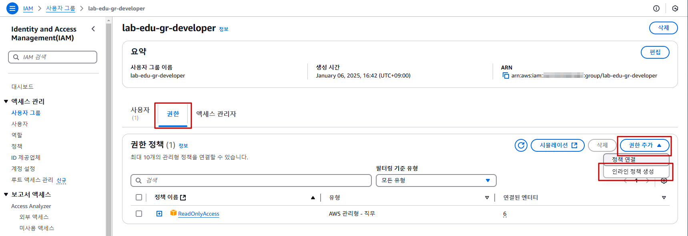
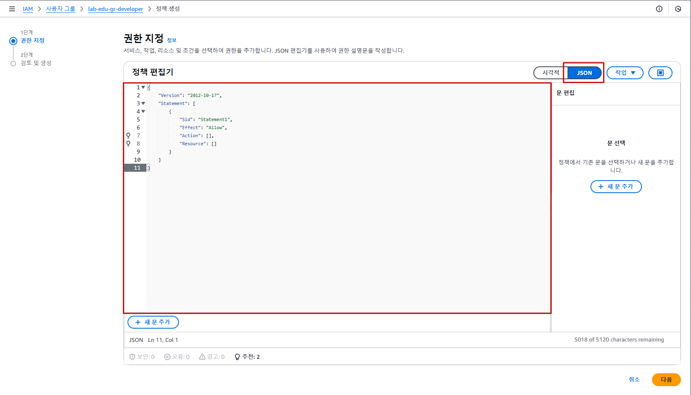
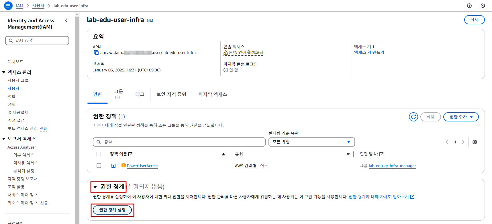

## Table of Contents
- [Table of Contents](#table-of-contents)
- [In-line Policy 생성 및 테스트](#in-line-policy-생성-및-테스트)
  - [1. In-line Policy 생성](#1-in-line-policy-생성)
  - [2. IAM User 이용 AWS Management Console 접속](#2-iam-user-이용-aws-management-console-접속)
  - [3. IAM Console 화면 접속 및 권한 테스트](#3-iam-console-화면-접속-및-권한-테스트)
- [Permission Boundary 생성 및 테스트](#permission-boundary-생성-및-테스트)
  - [1. Permission Boundary 생성](#1-permission-boundary-생성)
  - [2. IAM User 이용 AWS Management Console 접속](#2-iam-user-이용-aws-management-console-접속-1)
  - [3. IAM Console 화면 접속 및 권한 테스트](#3-iam-console-화면-접속-및-권한-테스트-1)

## In-line Policy 생성 및 테스트

그룹에 부여된 정책 가운데, 필요에 따라서 특정 작업을 거부하기 위해 인라인 정책을 이용할 수 있다. 인라인 정책을 통해 `lab-edu-gr-developer` 그룹에 IAM과 관련된 권한을 모두 `Deny` 하도록 설정한다.

### 1. In-line Policy 생성

- **IAM 메인 콘솔 화면 → `사용자 그룹` 리소스 탭 → `lab-edu-gr-developer` 그룹 클릭**

- `권한` 탭 → `권한 추가` 버튼 클릭 → `인라인 정책 생성` 버튼 클릭

  

- 정책 편집기의 `JSON` 버튼 클릭 → 아래의 정책 복사 → 붙여넣기 → `다음` 버튼 클릭

  

  ```json
  {
      "Version": "2012-10-17",
      "Statement": [
          {
              "Sid": "DenyAllIAMActions",
              "Effect": "Deny",
              "Action": "iam:*",
              "Resource": "*"
          }
      ]
  }
  ```
- 정책 이름: `IamActionAllDeny` 입력 → `정책 생성` 버튼 클릭

### 2. IAM User 이용 AWS Management Console 접속

- 웹 브라우저 시크릿 모드 실행 (브라우저에서 `Ctrl + Shift + n` 버튼 입력)

- **AWS 웹 사이트 *(https://aws.amazon.com/ko)* → 로그인 화면 이동**

- 로그인 정보 입력

    - 계정 ID: 97********00 (자신의 계정 Account ID 값 입력)

    - 사용자 이름: lab-edu-user-dev

    - 암호: ***PASSWORD*** (자신이 설정한 패스워드 입력)

    - `로그인` 버튼 클릭

### 3. IAM Console 화면 접속 및 권한 테스트

- **IAM 메인 콘솔 화면 이동 → 화면에 액세서 거부와 관련된 오류가 발생하는지 확인**

<br>

## Permission Boundary 생성 및 테스트

사용자 또는 역할을 대상으로 최대 권한을 할당할 수 있다. lab-edu-gr-infra-manager 그룹에 신입사원이 들어왔다고 가정할 경우 설정 실수를 방지하기 위해 `ReadOnlyAccess` 범위로 권한에 제약을 설정한다.

### 1. Permission Boundary 생성

- **IAM 메인 콘솔 화면 → `사용자` 리소스 탭 → `lab-edu-user-infra` 사용자 클릭**

- `권한 경계` 클릭 → `권한 경계 설정` 버튼 클릭

  

  - 권한 정책 연결: `ReadOnlyAccess` 검색 → 필터링 기준 유형: `AWS 관리형 - 직무` 선택 → `ReadOnlyAccess` 권한 선택 → `경계 설정` 버튼 클릭

### 2. IAM User 이용 AWS Management Console 접속

- 웹 브라우저 시크릿 모드 실행 (브라우저에서 `Ctrl + Shift + n` 버튼 입력)

- **AWS 웹 사이트 *(https://aws.amazon.com/ko)* → 로그인 화면 이동**

- 로그인 정보 입력

    - 계정 ID: 97********00 (자신의 계정 Account ID 값 입력)

    - 사용자 이름: lab-edu-user-infra

    - 암호: ***PASSWORD*** (자신이 설정한 패스워드 입력)

    - `로그인` 버튼 클릭

### 3. IAM Console 화면 접속 및 권한 테스트

- **S3 메인 콘솔 화면 → `버킷 만들기` 버킷 선택 → `permission-boundary-test-$ACCOUNT_ID` 입력 → `버킷 만들기` 버튼 클릭** 

- 권한과 관련된 오류가 발생하는지 확인


