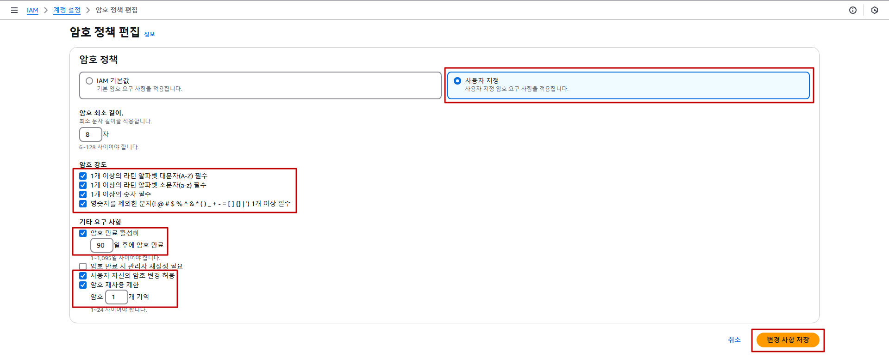

## IAM MFA 설정

### 1. 웹 브라우저에 Authenticator 설치

- 기존 웹 브라우저 화면으로 복귀

- 구글 검색창에 `웹 스토어` 검색 → `Chrome 웹 스토어` 클릭
    
    

- `Authenticator` 입력 → `인증 도구` 클릭 → `Chrome에 추가` 버튼 클릭

    

### 2. IAM User MFA 설정

- **IAM 메인 콘솔 화면 → 사용자 리소스 탭 → `lab-edu-gr-admin` 선택**

- `보안 자격 증명` 탭 → `멀티 팩터 인증(MFA)` 항목 → `MFA 디바이스 할당` 버튼 클릭

    

- MFA 설정 정보 입력

    - 디바이스 이름: Google-Authenticator

    - MFA devicd: 인증 관리자 앱

    - `다음` 버튼 클릭

        

    - 화면 중앙의 `QR 코드 표시` 클릭(QR 코드 확장 상태에서 진행) → 우측 상단의 `Authenticator` 버튼 클릭 →  `QR 코드 리더기` 버튼 클릭

        

    - 화면의 `QR 코드` 지정 → 우측 상단의 `Authenticator` 버튼 클릭 → `Google-Authenticator` 이름으로 등록된 OTP 확인 후 클릭(내용 복사) → `MFA 코드 1` 항목에 입력

        

    - `MFA 코드 1` 항목에 입력한 값과 다른 값으로 변경되면 복사 후 `MFA 코드 2` 항목에 내용 입력 (*※ 첫 번째 값과 두 번째 값을 다르게 입력해야 등록 가능*)

    - `MFA` 추가 버튼 클릭

### 3.MFA 설정 테스트

- 이전에 실행 중이던 웹 브라우저 시크릿 모드 창 종료 → 새로운 웹 브라우저 시크릿 모드 실행 (`Ctrl + Shift + n`)

- **AWS 웹 사이트 → 로그인 화면 이동** ***(※ AWS Web URL: https://aws.amazon.com/ko)***

- 로그인 정보 입력

    - 계정 ID: 97********00 (자신의 계정 Account ID 값 입력)

    - 사용자 이름: lab-edu-gr-admin

    - 암호: ***PASSWORD*** (자신이 설정한 패스워드 입력)

    - `로그인` 버튼 클릭

- MFA 코드 입력

    - 기존 웹 브라우저 창으로 이동 → `MFA 코드` 복사

    - 시크릿 모드 창으로 이동 → `MFA 코드` 붙여넣기 → `제출` 버튼 클릭

        

 

## IAM Password Policy 설정

IAM Password Policy는 IAM User 리소스에 적용되는 설정이다.(Root Account 제외) Password의 로테이션 기간 설정, 최소 암호 길이, 특정 문자 유형을 포함하도록 강제하는 설정을 추가 할 수 있다.

### 1. 웹 브라우저에 Authenticator 설치

- **IAM 메인 콘솔 화면 → `계정 설정` 리소스 탭 → `편집` 버튼 클릭**

  

- 아래의 정보를 참고해서 설정 (일반적으로 많이 설정하는 권장 값)
 
  - `1개 이상의 라틴 알파벳 대문자(A-Z) 필수` 체크

  - `1개 이상의 라틴 알파벳 소문자(a-z) 필수` 체크

  - `1개 이상의 숫자 필수` 체크

  - `영숫자를 제외한 문자(! @ # $ % ^ & * ( ) _ + - = [ ] {} | ') 1개 이상 필수` 체크

  - `암호 만료 활성화` 체크 → `90` 입력

  - `사용자 자신의 암호 변경 허용` 체크 

  - `암호 재사용 제한` 체크  → `1` 입력

  - `변경 사항 저장` 버튼 클릭
 
    

