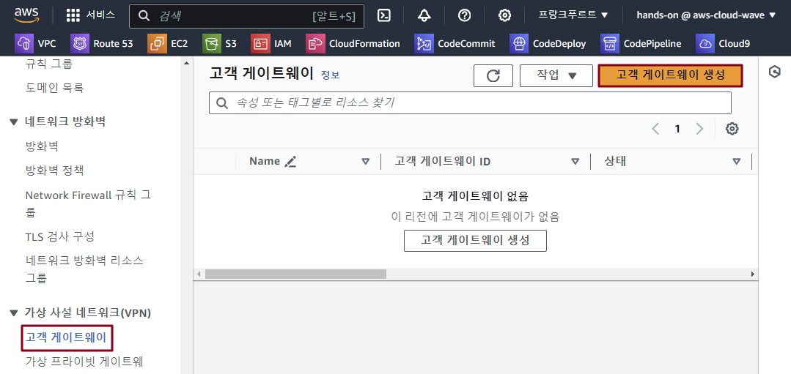
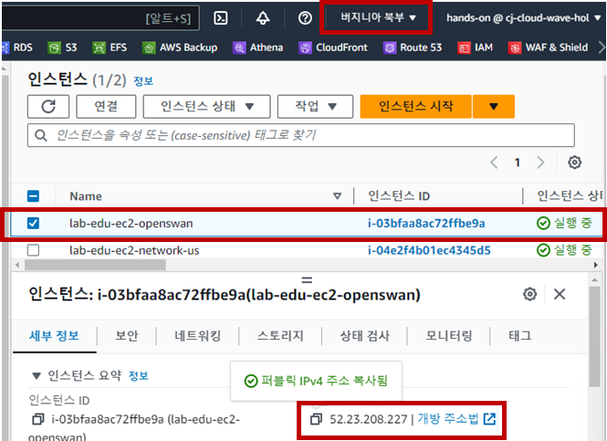
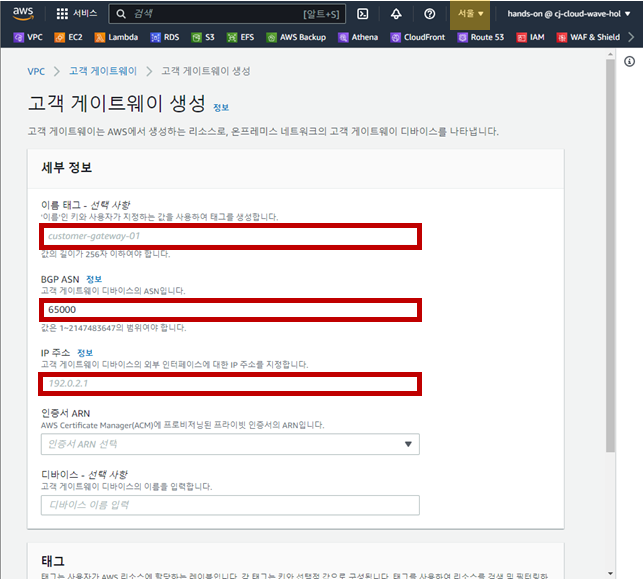
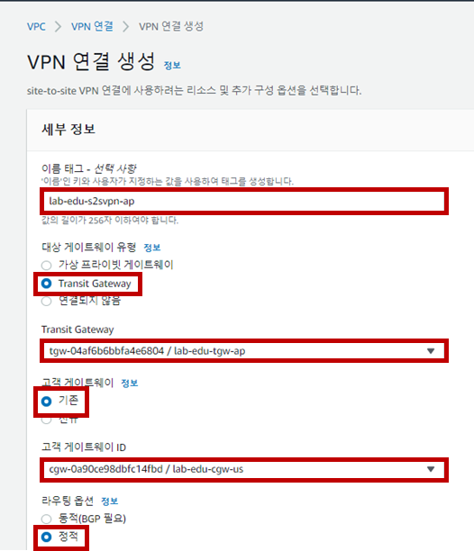
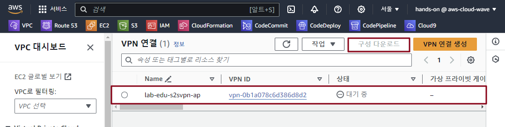
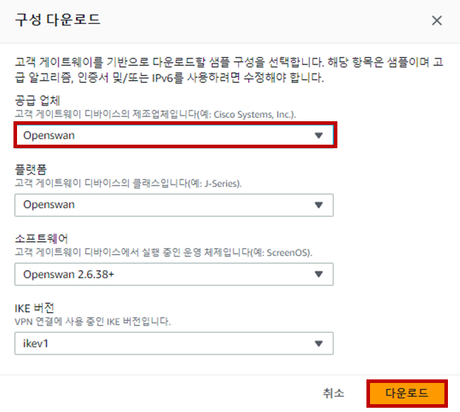
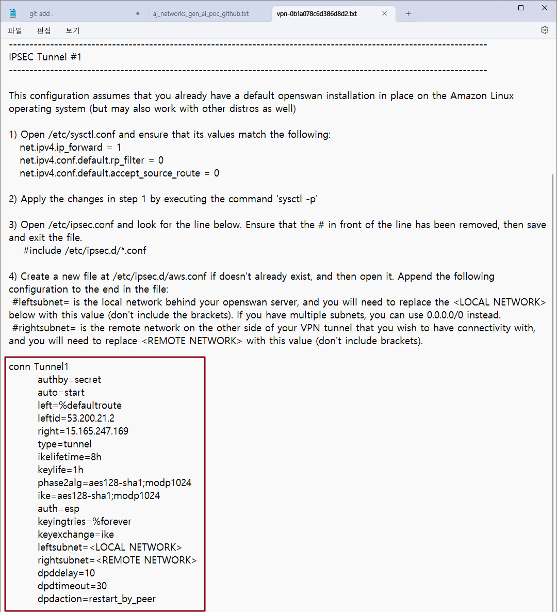
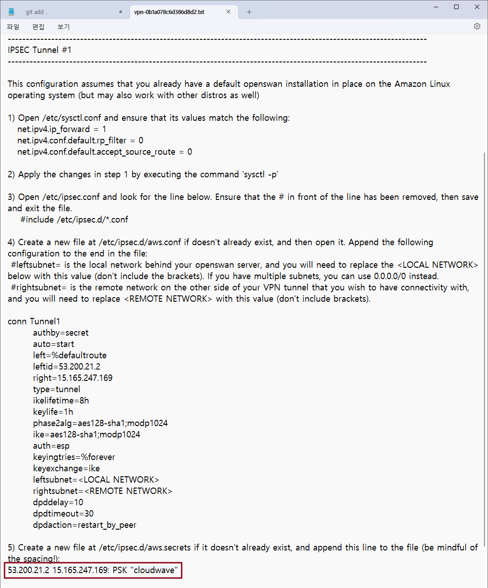
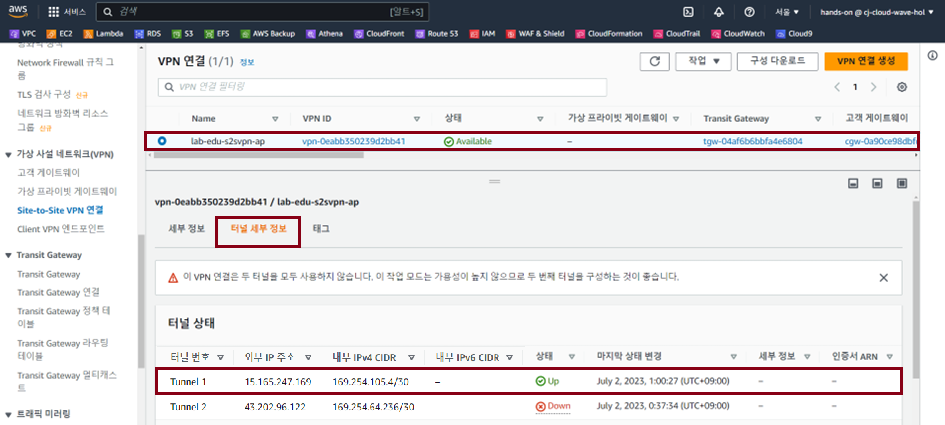

## Table of Contents
- [Table of Contents](#table-of-contents)
- [Site to Site VPN 설정](#site-to-site-vpn-설정)
  - [1. 서울 리전 Custom Gateway 생성](#1-서울-리전-custom-gateway-생성)
  - [2. 서울 리전 Site to Site VPN 리소스 생성](#2-서울-리전-site-to-site-vpn-리소스-생성)
  - [3. VPN 구성 다운로드](#3-vpn-구성-다운로드)
  - [4. Openswan 서버 설정](#4-openswan-서버-설정)
- [Transit Gateway 설정](#transit-gateway-설정)
  - [1. Transit Gateway Routing Table 설정](#1-transit-gateway-routing-table-설정)
  - [2. 서울 리전 VPC Routing Table 수정](#2-서울-리전-vpc-routing-table-수정)
  - [3. 버지니아 리전 VPC Routing Table 수정](#3-버지니아-리전-vpc-routing-table-수정)
  - [4. Network 통신 테스트](#4-network-통신-테스트)

## Site to Site VPN 설정

### 1. 서울 리전 Custom Gateway 생성

- **서울 리전으로 이동 → VPC 콘솔 메인 화면 → 고객 게이트웨이 리소스 탭 → `고객 게이트웨이 생성` 버튼 클릭**

    

- 버지니아 리전으로 이동 → 인스턴스 콘솔 메인 화면 → 인스턴스 리소스 탭 → `lab-edu-ec2-openswan-us` 선택 → Public IP 복사

    

- 고객 게이트웨이 생성 정보 입력

    - 이름: lab-edu-cgw-us

    - BGP ASN: 65100

    - IP Address: {VIRGINIA_REGION_OPENSWAN_SERVER_PUBLIC_IP}

    - `고객 게이트웨이 생성` 버튼 클릭

        

### 2. 서울 리전 Site to Site VPN 리소스 생성

- **서울 리전으로 이동 → VPC 콘솔 메인 화면 → Site to Site VPC 연결 리소스 탭 → `VPN 연결 생성` 버튼 클릭**

- `Site to Site VPC 연결` 생성 정보 입력

    - 이름: lab-edu-s2svpn-ap

    - 대상 게이트웨이 유형: Transit Gateway

    - Transit Gateway: lab-edu-tgw-ap

    - 고객 게이트웨이: 기존

    - 고객 게이트웨이 ID: lab-edu-cgw-us

    - 라우팅 옵션: 정적

        

    - 로컬 IPv4 네트워크 CIDR: 10.30.0.0/16

    - 원격 IPv4 네트워크 CIDR: 10.0.0.0/16

    - 터널 1, 2 옵션의 사전 공유 키: cloudwave

    - `VPN 연결 생성` 버튼 클릭

        

### 3. VPN 구성 다운로드

- **서울 리전으로 이동 → VPC 콘솔 메인 화면 → `Site to Site VPC 연결` 리소스 탭 → `lab-edu-s2svpn-ap` 선택 → `구성 다운로드` 버튼 클릭**

    

- 구성 다운로드 설정 정보 입력

    - 공급 업체: Openswan

    - 플랫폼: Openswan

    - 소프트웨어: Openswan 2.6.38+

    - IKE 버전: ikev1

    - `다운로드` 버튼 클릭

        

### 4. Openswan 서버 설정

- **버지니아 리전으로 이동 → EC2 콘솔 메인 화면 → 인스턴스 리소스 탭 → `lab-edu-ec2-openswan-us` 선택 → `연결` 버튼 클릭**

- `Session Manager` 탭으로 이동 → `연결` 버튼 클릭

- sysctl.conf 파일 설정

    ```bash
    sudo su -
    ```

    ```bash
    vim /etc/sysctl.conf
    ```

    ```bash
    net.ipv4.ip_forward = 1  
    net.ipv4.conf.default.rp_filter = 0   
    net.ipv4.conf.default.accept_source_route = 0
    ```

- 구성 다운로드 파일 열기 → 설정 내용 복사

    

- aws.conf 파일 설정 (구성 다운로드 파일 다운로드 내용 붙여넣기 → 수정)

    ```bash
    vim /etc/ipsec.d/aws.conf
    ```

    ```bash
    conn Tunnel1
        authby=secret
        auto=start
        left=%defaultroute
        leftid=52.23.208.227
        right=13.125.161.188
        type=tunnel
        ikelifetime=8h
        keylife=1h
        phase2alg=aes128-sha1;modp1024
        ike=aes128-sha1;modp1024
        auth=esp	                 # 삭제!!
        keyingtries=%forever
        keyexchange=ike
        leftsubnet=<LOCAL NETWORK>	 # <LOCAL NETWORK> 삭제 → 10.30.0.0/16 입력
        rightsubnet=<REMOTE NETWORK> # <REMOTE NETWORK> 삭제 → 10.0.0.0/16 입력
        dpddelay=10
        dpdtimeout=30
        dpdaction=restart_by_peer
    ```

- 구성 다운로드 파일 열기 → 설정 내용 복사

    

- aws.secrets 파일 설정 (구성 다운로드 파일 다운로드 내용 붙여넣기)

    ```bash
    vim /etc/ipsec.d/aws.ecrets
    ```

    ```bash
    53.200.21.2 15.165.247.169: PSK "cloudwave"
    ```

- Openswan 재시작

    ```bash
    systemctl restart network
    ```

    ```bash
    systemctl restart ipsec.service
    ```

    ```bash
    systemctl status ipsec.service
    ```

    

## Transit Gateway 설정

### 1. Transit Gateway Routing Table 설정

- **서울 리전으로 이동 → VPC 콘솔 메인 화면 → Transit Gateway 라우팅 테이블 리소스 탭 → `Routing Table` 선택**

- `경로` 탭 → `정적 경로 생성` 버튼 클릭

- 정적 경로 생성 정보 입력 → `정적 경로 생성` 버튼 클릭

    - CIDR: 10.20.0.0/16

    - 연결 선택: lab-edu-s2svpn-ap

### 2. 서울 리전 VPC Routing Table 수정

- **서울 리전으로 이동 → VPC 콘솔 메인 화면 → 라우팅 테이블 탭 → `lab-edu-rtb-pri-01` 선택 → `라우팅` 탭 → `라우팅 편집` 버튼 클릭**

- 라우팅 테이블 경로 생성 정보 입력

    - `라우팅 추가` 버튼 클릭

    - 대상: 10.20.0.0/16

    - 대상: Trangit Gateway (lab-edu-tgw-att-ap01)

    - `변경 사항 저장` 버튼 클릭

### 3. 버지니아 리전 VPC Routing Table 수정

- **버지니아 리전으로 이동 → VPC 콘솔 메인 화면 → 라우팅 테이블 탭 → `lab-edu-rtb-us-pri` 선택 → `라우팅` 탭 → `라우팅 편집` 버튼 클릭**

- 라우팅 테이블 경로 생성 정보 입력

    - `라우팅 추가` 버튼 클릭

    - 대상: 10.0.0.0/16

    - 대상: 인스턴스 (lab-edu-ec2-openswan-us)

    - `변경 사항 저장` 버튼 클릭

### 4. Network 통신 테스트

- **버지니아 리전으로 이동 → EC2 메인 콘솔 화면 → 인스턴스 리소스 탭 → `lab-edu-ec2-network-us` 선택 → Private IP 주소 복사**

- VS Code Terminal에서 ssh 명령을 통해 Web Server 접속

    ```bash
    ssh web-server
    ```

- ICMP 통신 테스트 진행

    ```bash
    ping {VIRGINIA_REGION_NETWORK_SERVER_PRIVATE_IP}
    PING 10.20.40.196 (10.20.40.196) 56(84) bytes of data.
    64 bytes from 10.20.40.196: icmp_seq=1 ttl=253 time=188 ms
    64 bytes from 10.20.40.196: icmp_seq=2 ttl=253 time=187 ms
    64 bytes from 10.20.40.196: icmp_seq=3 ttl=253 time=187 ms
    64 bytes from 10.20.40.196: icmp_seq=4 ttl=253 time=188 ms