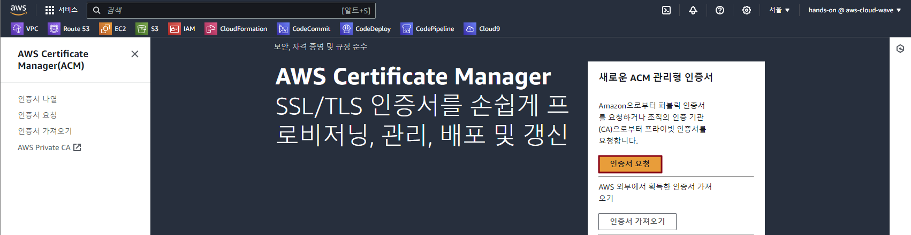
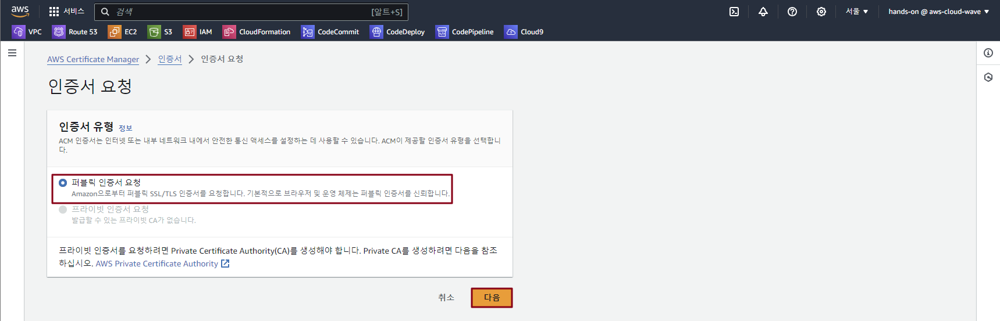
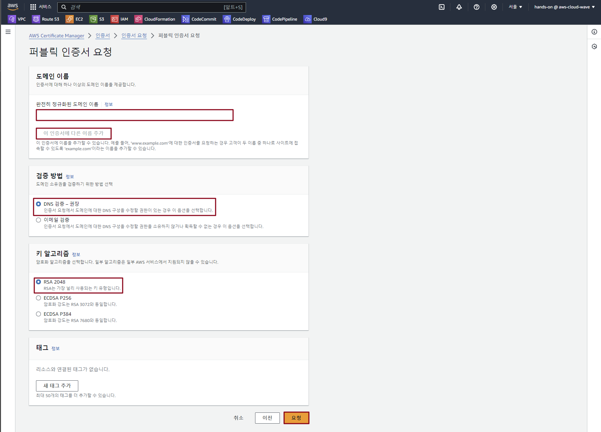
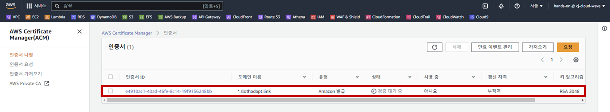
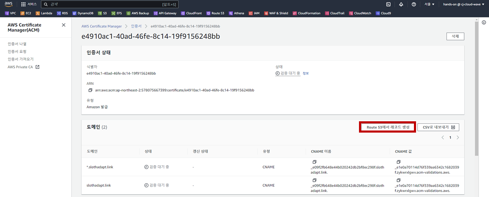
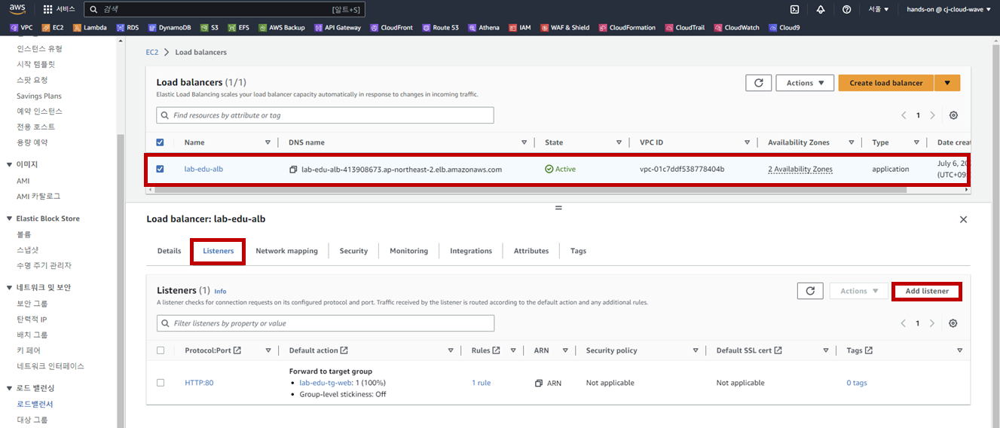
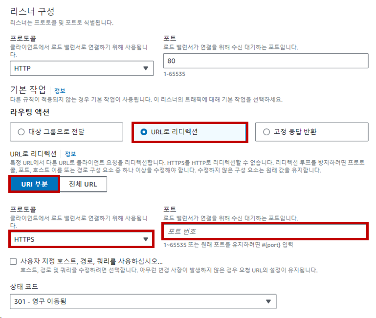

## Table of Contents
- [Table of Contents](#table-of-contents)
- [AWS Certificate Manager 생성](#aws-certificate-manager-생성)
- [Route 도메인 정보 등록](#route-도메인-정보-등록)
- [Application Load Balancer 설정](#application-load-balancer-설정)
  - [1. Load Balancer Listener 등록](#1-load-balancer-listener-등록)
  - [2. HTTP Redirect 설정](#2-http-redirect-설정)

## AWS Certificate Manager 생성

- **Certificate Manager 메인 콘솔 화면 → `인증서 요청` 버튼 클릭**

    

- `퍼블릭 인증서 요청` 선택 → `다음` 버튼 클릭

    

- ACM 생성 정보 입력

    - 완전히 정규화된 도메인 이름: ***\*.stxx.cj-cloud-wave.com***

    - `이 인증서에 다른 이름 추가` 버튼 클릭

    - 두 번째 정규화된 도메인 이름: ***stxx.cj-cloud-wave.com***

    - 검증 방법: DNS 검증

    - 키 알고리즘: RSA 2048

    - `요청` 버튼 클릭

        

- 검증 대기 상태의 도메인 이름 클릭 

    

- `Route 53에서 레코드 생성` 버튼 클릭

    

##  Route 도메인 정보 등록

- **Route 53 메인 콘솔 화면 → 호스팅 영역 리소스 탭 → `stxx.cj-cloud-wave.com` 클릭 → `레코드 생성` 버튼 클릭**

- Routing Policy 생성 정보 입력

    - 레코드 이름: *

    - 레코드 유형: ***A***

    - `별칭` 버튼 클릭

    - `Application/Classic Load Balancer에 대한 별칭` 선택

    - `아시아 태평양(서울) [ap-northeast-2]` 선택

    - `dualstack.lab-edu-alb-***[임의숫자]***.ap-northeast-2.elb.amazonaws.com` 선택

    - `레코드 생성` 버튼 클릭

## Application Load Balancer 설정

### 1. Load Balancer Listener 등록

- **EC2 메인 콘솔 화면 → 로드밸런서 탭 → *lab-edu-alb-web* 선택 → `Listeners` 탭 → `Add listener` 버튼 클릭**

    

- 리스너 생성 정보 입력

    - Protocol: HTTPS

    - Default actions: Forward to

    - Target group: lab-edu-tg-web

    - Default SSL/TLS certificate: ***\*.stxx.cj-cloud-wave.com***

- 웹 서비스 접속 테스트 (*https://www.stxx.cj-cloud-wave.com*)

### 2. HTTP Redirect 설정

- **EC2 메인 콘솔 화면 → 로드밸런서 탭 → *lab-edu-alb-web* 선택**

- **`Listeners` 탭 → `HTTP:80` 선택 → `리스너 관리` 버튼 클릭 → `리스너 편집` 클릭**

- 리스너 편집 정보 입력

    - `URL로 리디렉션` 선택

    - `URI 부분` 선택

    - 프로토콜: HTTPS

    - 포트: 443

        

- 웹 서비스 접속 테스트 (*http://www.stxx.cj-cloud-wave.com*)

 