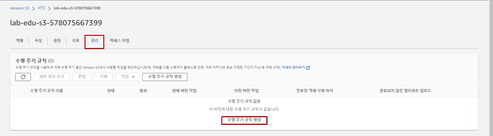
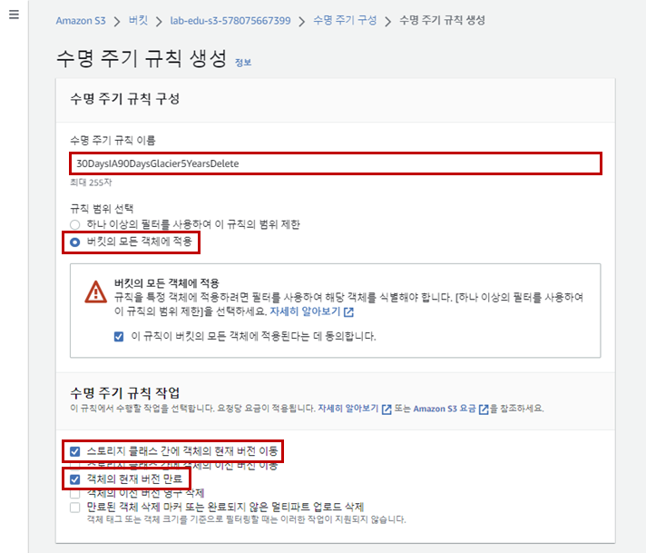
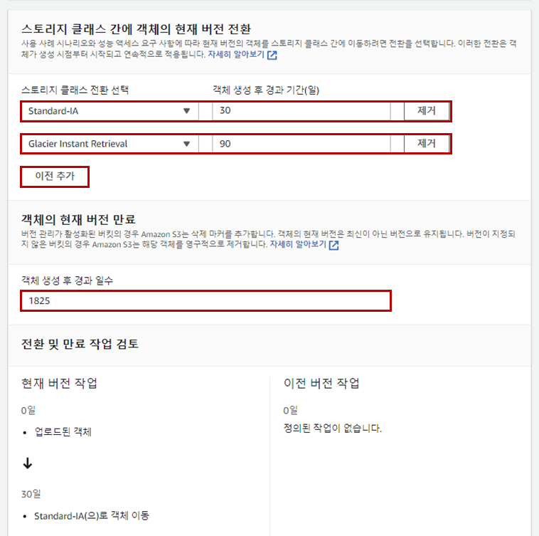

## Table of Contents
- [Table of Contents](#table-of-contents)
- [Amazon S3 수명 주기 규칙 생성](#amazon-s3-수명-주기-규칙-생성)

## Amazon S3 수명 주기 규칙 생성

- **S3 콘솔 메인 화면 → *`lab-edu-bucket-image-{ACCOUNT_ID}`* 선택 → `관리` 탭 이동 → `수명 주기 규칙 생성` 버튼 클릭**

    

- 수명 주기 규칙 생성 정보 입력

    - 규칙 이름: 30DaysIA90DaysGlacier5YearsDelete

    - 규칙 범위 선택: 버킷의 모든 객체에 적용

    - 수명 주기 규칙 작업:

        - `스토리지 클래스 간에 객체의 현재 버전 이동` 체크

        - `객체의 현재 버전 영구 삭제` 체크

    

    - 스토리지 클랙스 전환 선택 : Standard IA

    - 객체 생성 후 경과 기간: 30

    - `이전 추가` 버튼 클릭

    - 스토리지 클랙스 전환 선택 : Glacier Instance Retrieval 

    - 객체 생성 후 경과 기간: 90    

    - 객체 생성 후 경과 일수 : 1825
    
    - `규칙 생성` 버튼 클릭

        

