## Table of Contents
- [Table of Contents](#table-of-contents)
- [Same Region Replication](#same-region-replication)
  - [1. Image Bucket Versioning 활성화](#1-image-bucket-versioning-활성화)
  - [2. Replication 실습용 버킷 생성](#2-replication-실습용-버킷-생성)
  - [3. Replication 생성](#3-replication-생성)
  - [4. 복제 결과 확인](#4-복제-결과-확인)

## Same Region Replication

### 1. Image Bucket Versioning 활성화

- **S3 콘솔 메인 화면 → *`lab-edu-bucket-image-{ACCOUNT_ID}`* 선택 → `속성` 탭 이동 → 버킷 버전 관리 항목의 `편집` 버튼 클릭**

  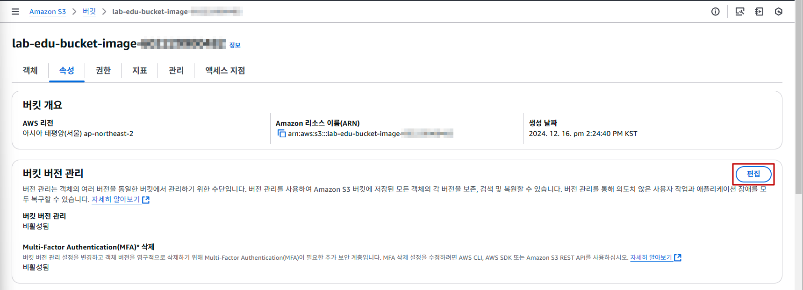

- `활성화` 체크 → `변경 사항 저장` 버튼 클릭

  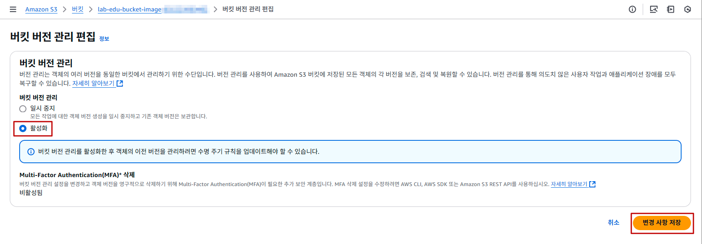

### 2. Replication 실습용 버킷 생성

- **S3 콘솔 메인 화면 → `버킷 만들기` 버튼 클릭**

- S3 버킷 생성 정보 입력

    - 버킷 이름: lab-edu-bucket-image-{ACCOUNT_ID}-backup

    - 버킷 버전 관리 `활성화` 체크

      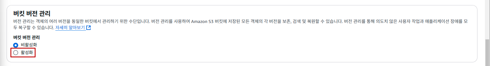

    - `버킷 생성` 버튼 클릭

### 3. Replication 생성

- **S3 콘솔 메인 화면 → *`lab-edu-bucket-image-{ACCOUNT_ID}`* 선택 → `관리` 탭 이동 → 복제 규칙 항목의 `복제 규칙 생성` 버튼 클릭**

  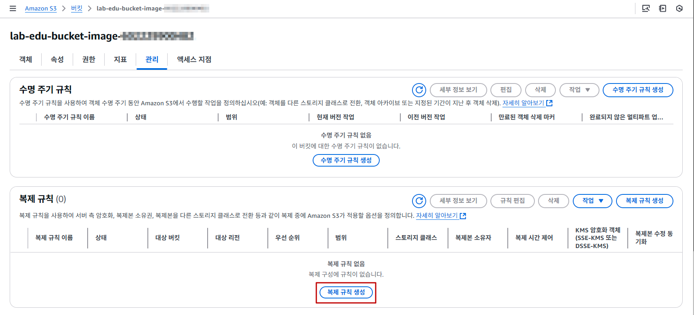

- 버킷 복제 규칙 생성 정보 입력

    - 버킷 이름: lab-edu-bucket-srr

      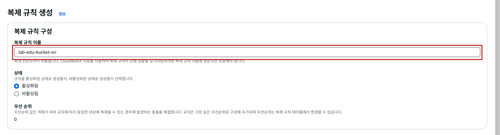

    - 규칙 범위 선택에서 `버킷의 모든 객채에 적용` 선택

      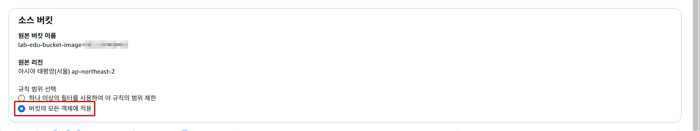

    - 대상 항목에서 `이 계정에서 버킷 선택` 선택 → 버킷 이름 입력: lab-edu-bucket-image-{ACCOUNT_ID}-backup

      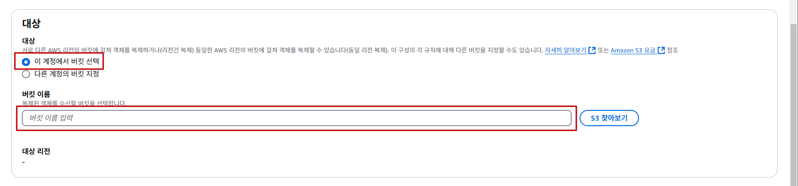

    - IAM 역할 항목에서 `새 역할 생성` 선택 

      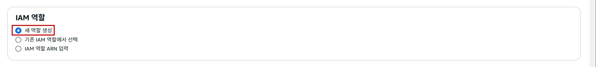

    - `저장` 버튼 클릭

- `예, 기존 객체를 복제합니다.` 선택 → `제출` 버튼 클릭

  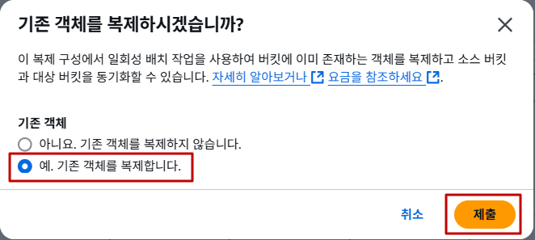

- `완료 보고서 생성` 체크 해제 → `새 역할 생성` 선택 → `저장` 버튼 클릭

  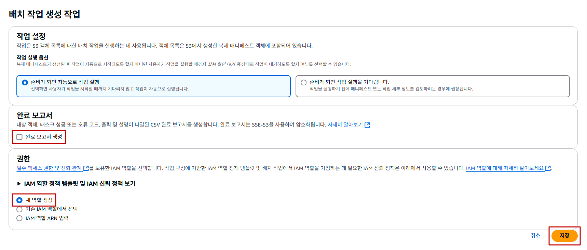

### 4. 복제 결과 확인

- 생성된 배치 `작업 ID` 클릭

  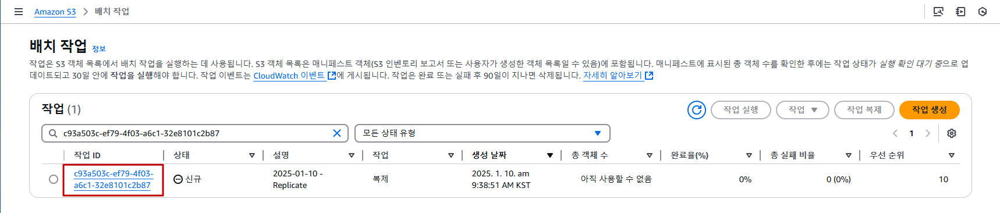

- 완료 상태 체크

  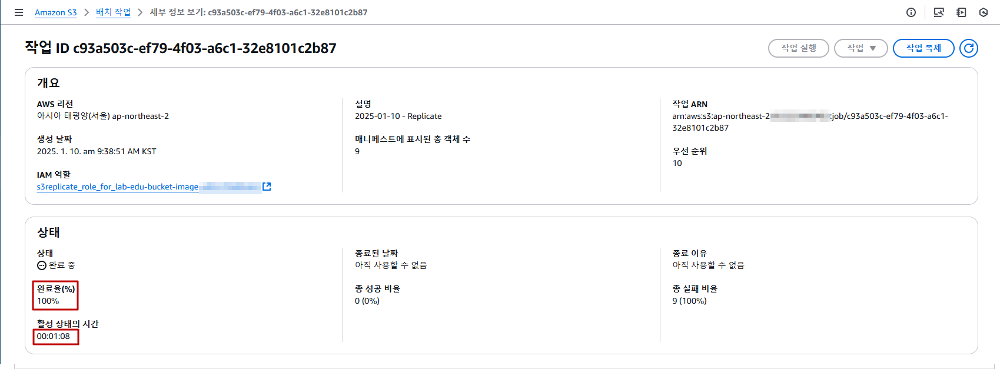

- **S3 콘솔 메인 화면 → *`lab-edu-bucket-image-{ACCOUNT_ID}-backup`* 선택 → `새로고침` 버튼 클릭 → 복제된 객체 확인**

  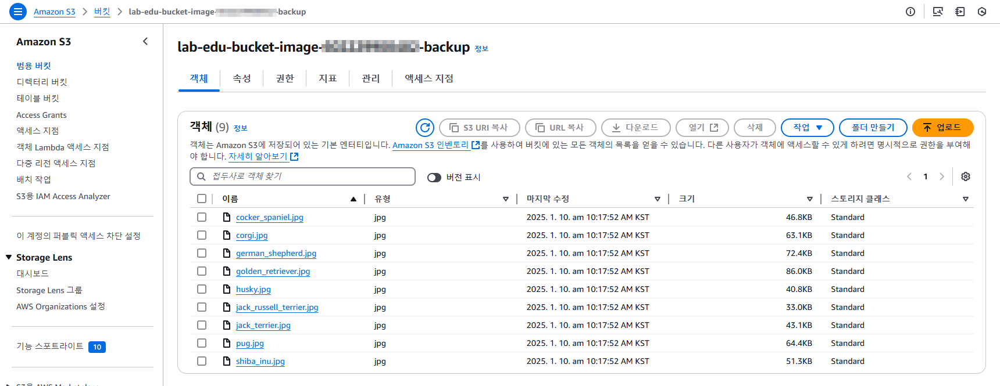

 