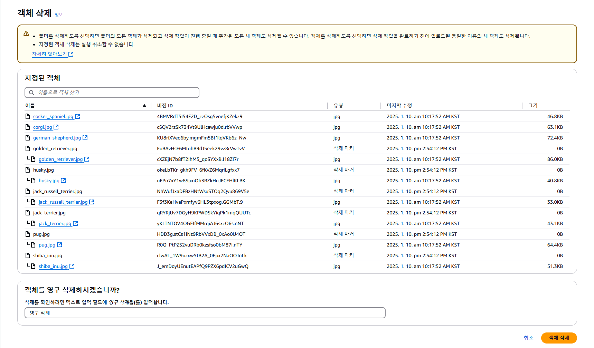

## Table of Contents
- [Table of Contents](#table-of-contents)
- [콘솔 화면에서 버전이 활성화된 버킷 객체 삭제하기](#콘솔-화면에서-버전이-활성화된-버킷-객체-삭제하기)
  - [1. Simple DELETE 테스트](#1-simple-delete-테스트)
  - [2. Perminently DELETE 테스트](#2-perminently-delete-테스트)
- [AWS CLI로 버전이 활성화된 버킷 객체 삭제하기](#aws-cli로-버전이-활성화된-버킷-객체-삭제하기)
  - [1. Sample Data 업로드](#1-sample-data-업로드)
  - [2. Bucket 데이터 업로드 결과 확인 및 Delete Marker 생성](#2-bucket-데이터-업로드-결과-확인-및-delete-marker-생성)
  - [3. AWS CLI로 객체의 Delete Marker Version ID 확인](#3-aws-cli로-객체의-delete-marker-version-id-확인)
  - [4. Delete Marker 삭제](#4-delete-marker-삭제)
  - [5. 객체의 Version ID 확인 및 영구 삭제](#5-객체의-version-id-확인-및-영구-삭제)
- [Lifecycle 설정을 통해 이전 버전 객체 및 Delete Marker 관리](#lifecycle-설정을-통해-이전-버전-객체-및-delete-marker-관리)
  - [1. Amazon S3 수명 주기 규칙 생성](#1-amazon-s3-수명-주기-규칙-생성)

## 콘솔 화면에서 버전이 활성화된 버킷 객체 삭제하기

### 1. Simple DELETE 테스트

Simple Delete 요청은 Permanently Delete와 다르게 Version ID를 지정하지 않는 삭제 방식이다. 버전이 활성화 된 상태에서 버전 지정 없이 삭제 요청할 경우 실제 객체가 삭제되는 것이 아니라 Delete Marker가 만들어진다.

- **S3 콘솔 메인 화면 → *`lab-edu-bucket-image-{ACCOUNT_ID}-backup`* 선택**


- 전체 객체 지정 → `삭제` 버튼 클릭

  

- `삭제` 입력 → `전체 삭제` 버튼 클릭

- `버전 표시` 활성화 → Delete Marker 정보 확인

  

- 유형이 `삭제 마커` 유형인 객체 3개 선택 → `삭제` 버튼 클릭

  

- `영구 삭제` 입력 → `객체 삭제` 버튼 클릭

- `버전 표시` 비활성화 → 복구된 3개의 객체 정보 확인

  

### 2. Perminently DELETE 테스트

버전 활성화 된 상태에서 `버전 표시` 활성화 없이 콘솔에서 삭제를 시도하면 Simple Delete 방식으로 삭제된다. `버전 표시`를 활성화 한 다음 삭제 화면에 들어가면 확인 문구 입력창이 `삭제`에서 `영구 삭제`로 입력 해야 하는 내용이 변경된 것을 확인할 수 있다.

전체 삭제를 하고 난 다음 다시 화면을 확인하면, `버전 표시`가 활성화 되어 있는 상태에서도 객체가 보이지 않고, 영구적으로 삭제된 것을 확인할 수 있다.

- `버전 표시` 활성화 → 전체 객체 지정 → `삭제` 버튼 클릭

- `영구 삭제` 입력 → `전체 삭제` 버튼 클릭

  

<br>


## AWS CLI로 버전이 활성화된 버킷 객체 삭제하기

### 1. Sample Data 업로드

- Sample Image 파일 디렉터리 이동

  ```bash
  cd /Workshop/streamlit-project/images/animal_picture
  ```

- Account ID 정보 확인

  ```bash
  aws sts get-caller-identity --query Account --output text
  ```

- Sample Image 파일 Bucket으로 업로드

  ```bash
  aws s3 cp ./ s3://lab-edu-bucket-image-{ACCOUNT_ID} --recursive
  ```

### 2. Bucket 데이터 업로드 결과 확인 및 Delete Marker 생성

- AWS CLI 이용 객체 목록 확인

  ```
  aws s3 ls s3://lab-edu-bucket-image-{ACCOUNT_ID}-backup
  ```

- 전체 객체 Simple Delete

  ```
  aws s3 rm s3://lab-edu-bucket-image-{ACCOUNT_ID}-backup --recursive
  ```

### 3. AWS CLI로 객체의 Delete Marker Version ID 확인

버킷을 관리할 때 기본적인 Command는 `aws s3`로 가능하지만, 세부적인 기능을 다룰 때는 `aws s3api` 를 이용해야한다.

  - Delete Marker Version ID 조회

    ```bash
    aws s3api list-object-versions --bucket lab-edu-bucket-image-${ACCOUNT_ID}-backup --query 'DeleteMarkers[].{Key:Key,VersionId:VersionId}' --output json | jq -c '.[]'
    ```

  - Delete Marker Key / VersionId 조회 결과 값 확인

    ```bash
    {"Key":"cocker_spaniel.jpg","VersionId":"ttnXSuegxF66Kq9EQQETVcgi.artXSwT"}
    {"Key":"corgi.jpg","VersionId":"AA_EYT0G_WB0aojreTJlOLWnEfjpWj78"}
    {"Key":"german_shepherd.jpg","VersionId":"MS1T8Li3oLXLCITXc3a9RzR60P9paVl9"}
    {"Key":"golden_retriever.jpg","VersionId":"jf_sLqc6jSt83H9IMugsJpST50adENjc"}
    {"Key":"husky.jpg","VersionId":"muDo6Xql0a7lsyQTJlgfUffmQcUgz57S"}
    {"Key":"jack_russell_terrier.jpg","VersionId":"3oesKnk4g71ft8Er4xxSP6DjhUgWsAW3"}
    {"Key":"jack_terrier.jpg","VersionId":"iIWS9m1NJe2gYd9Utxbn5SP7Z_.PEXD6"}
    {"Key":"pug.jpg","VersionId":"CdGWwEz7Kkof7TEPy7RUe2N6nHu_Hxcj"}
    {"Key":"shiba_inu.jpg","VersionId":"R483DlcTr0UOha4NlHSlJqH.OXsz6WPe"}
    ```

### 4. Delete Marker 삭제

- Delete Marker Version ID 지정 삭제

  ```bash
  aws s3api delete-object --bucket lab-edu-bucket-image-${ACCOUNT_ID}-backup --key cocker_spaniel.jpg --version-id ttnXSuegxF66Kq9EQQETVcgi.artXSwT
  ```

- Delete Marker 삭제 Script 디렉터리로 이동 → Script 실행

  ```bash
  cd /Workshop/streamlit-project/scripts
  ```

  ```bash
  ./delete_marker_Perminently_delete.sh
  ```

### 5. 객체의 Version ID 확인 및 영구 삭제

- Object Version ID 조회

  ```bash
  aws s3api list-object-versions --bucket lab-edu-bucket-image-${ACCOUNT_ID}-backup --query 'Versions[].{Key:Key,VersionId:VersionId}' --output json | jq -c '.[]'
  ```

- Object 전체 삭제 Script 디렉터리로 이동 → Script 실행

  ```bash
  cd /Workshop/streamlit-project/scripts
  ```

  ```bash
  ./object_Perminently_delete.sh
  ```

- Object 삭제 확인

  ```bash
  aws s3 ls s3://lab-edu-bucket-image-${ACCOUNT_ID}-backup
  ```

<br>


## Lifecycle 설정을 통해 이전 버전 객체 및 Delete Marker 관리

### 1. Amazon S3 수명 주기 규칙 생성

- **S3 콘솔 메인 화면 → *`lab-edu-bucket-image-{ACCOUNT_ID}-backup`* 선택 → `관리` 탭 이동 → `수명 주기 규칙 생성` 버튼 클릭**

- 수명 주기 규칙 생성 정보 입력

    - 규칙 이름: NoncurrentVersionPerminentlyDelete

    - 규칙 범위 선택: 버킷의 모든 객체에 적용

    - 수명 주기 규칙 작업:

      - `스토리지 클래스 간에 객체의 이전 버전 전환` 체크 → `본인은 이 수명 주기 규칙으로 인해 요청당 전환 비용이 발생함을 인지합니다` 체크

      - `객체의 이전 버전 영구 삭제` 체크

      - `객체의 현재 버전 영구 삭제` 체크

    - 스토리지 클래스 간에 객체의 이전 버전 전환

      - 스토리지 클래스 전환 선택: Glacier Instance Retrieval

      - 객체가 최신이 아닌 상태로 전환된 후 경과 기간(일): 7

      - 보관할 새 버전 수: 10

    - 객체의 이전 버전 영구 삭제

      - 객체가 최신이 아닌 상태로 전환된 후 경과 일수: 30

    - 만료된 객체 삭제 마커 또는 완료되지 않은 멀티파트 업로드 삭제

      - `만료된 객체 삭제 마커 삭제` 체크
    
    - `규칙 생성` 버튼 클릭