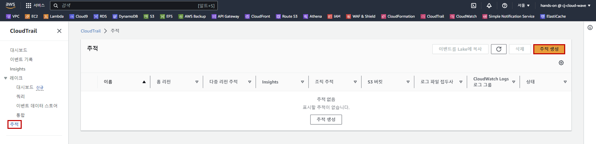
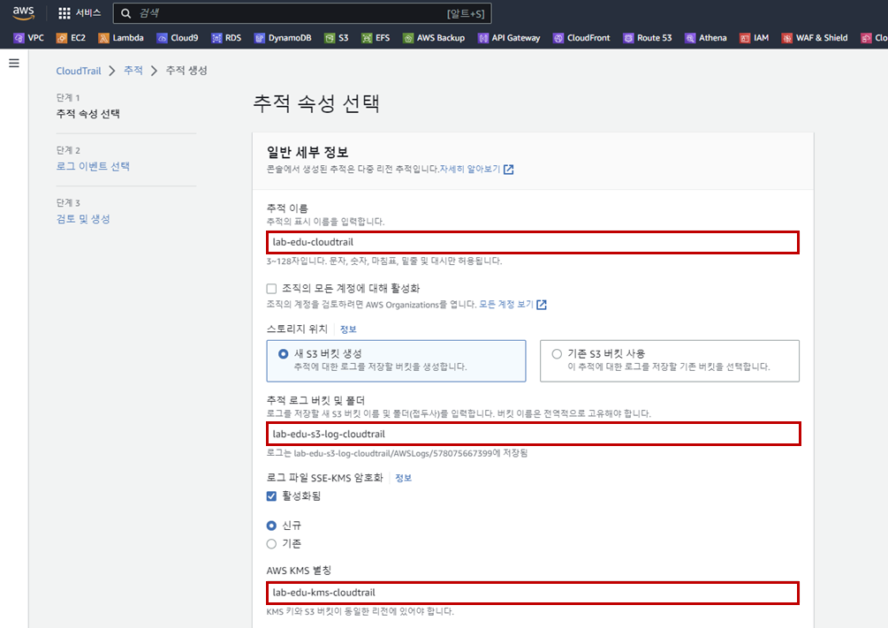
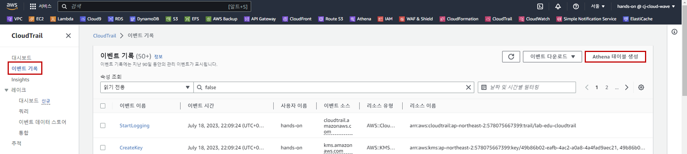
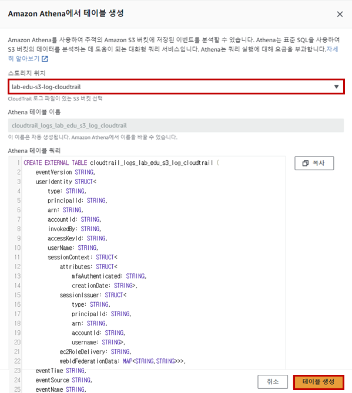
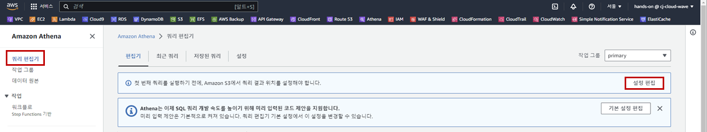
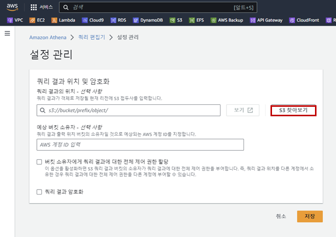
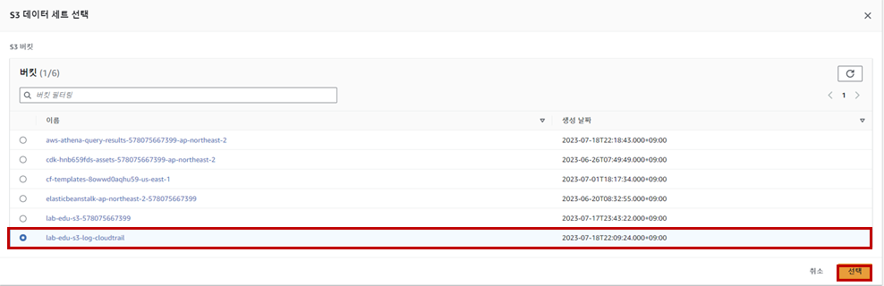
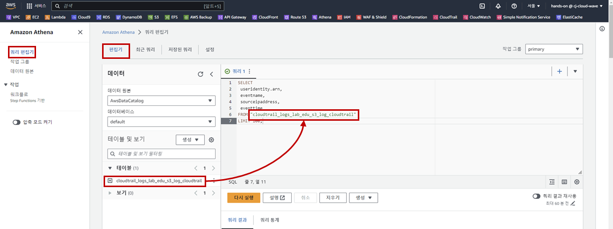
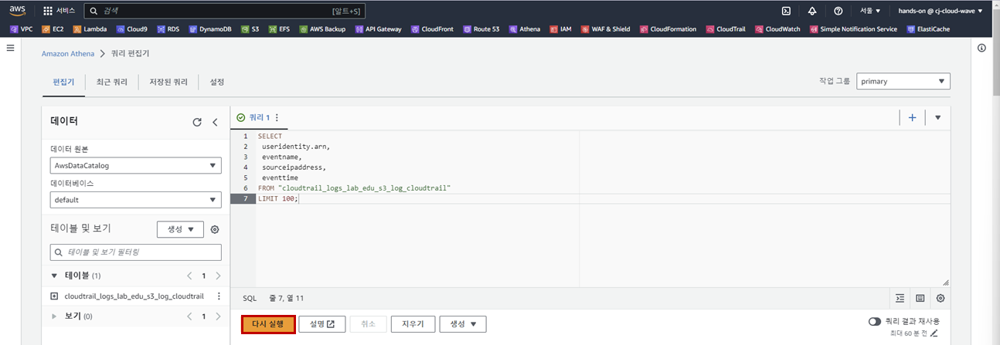

## Table of Contents
- [Table of Contents](#table-of-contents)
- [CloudTrail 로그 생성](#cloudtrail-로그-생성)
  - [1. CloudTrail 활성화](#1-cloudtrail-활성화)
- [Athena 이용 로깅 데이터 검색](#athena-이용-로깅-데이터-검색)
  - [1. Athena 테이블 생성](#1-athena-테이블-생성)
  - [2. Athena 이용 로그 데이터 검색](#2-athena-이용-로그-데이터-검색)

## CloudTrail 로그 생성

### 1. CloudTrail 활성화

- **CloudTrail 메인 콘솔 화면 → `추적` 리소스 탭 → `추적 생성` 버튼 클릭**

    

- CloudTrail 생성 정보 입력

    - 추적 이름: lab-edu-cloudtrail

    - 추적 로그 버킷 및 폴더: lab-edu-s3-log-cloudtrail-*{ACCOUNT_ID}*

    - AWS KMS 별칭: lab-edu-kms-cloudtrail

    - `추적 생성` 버튼 클릭

        

<br>

## Athena 이용 로깅 데이터 검색

### 1. Athena 테이블 생성

- **CloudTrail 메인 콘솔 화면 → `이벤트 기록` 리소스 탭 → `Athena 테이블 생성` 버튼 클릭**

    

- Athena 테이블 생성 정보 입력

    - 스토리지 위치: lab-edu-s3-log-cloudtrail-*{ACCOUNT_ID}*

    - `테이블 생성` 버튼 클릭

        

- **Athena 메인 콘솔 화면 → `쿼리 편집기` 탭 → `설정 편집` 버튼 클릭**

    

- 설정 정보 입력

    - `S3 찾아보기` 버튼 클릭

        

    - S3 데이터 세트 선택: lab-edu-s3-log-cloudtrail-*{ACCOUNT_ID}*

    - `선택` 버튼 클릭

        

    - `저장` 버튼 클릭

### 2. Athena 이용 로그 데이터 검색

- CloudTrail 로그 검색을 위해 아래의 `Query` 복사

    ```sql
    SELECT
    useridentity.arn,
    eventname,
    sourceipaddress,
    eventtime
    FROM {CLOUDTRAIL_LOGS}
    LIMIT 100;
    ```

- **Athena 메인 콘솔 화면 → 화면 좌측의 `쿼리 편집기` 클릭 → `편집기` 탭 → 쿼리 내용 붙여 넣기 → 편집기 화면 좌측의 `▼ 테이블` 항목에서 테이블 이름 복사 → 쿼리의 `{CLOUDTRAIL_LOGS}` 삭제 후 붙여넣기**

    

- `실행` 버튼 클릭

    

<br>