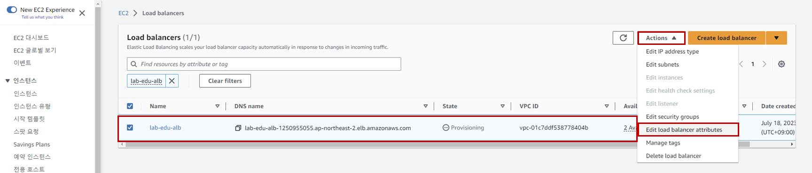
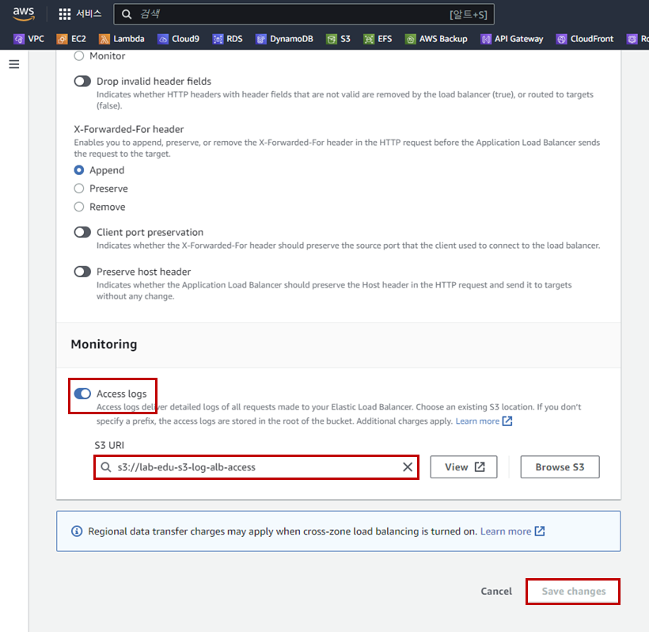
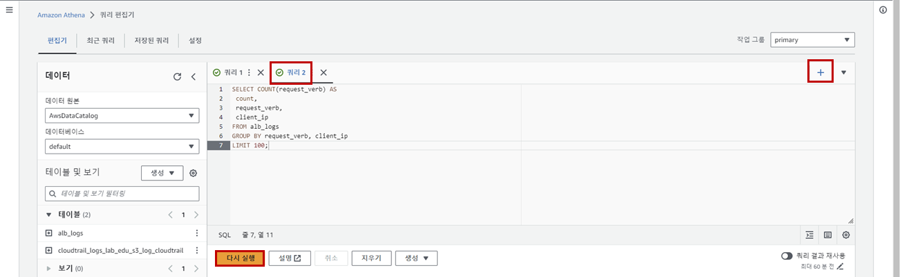

## Table of Contents
- [Table of Contents](#table-of-contents)
- [Elastic Load Balancer 로그 생성](#elastic-load-balancer-로그-생성)
  - [1. ALB Access Logging 전용 S3 버킷 생성](#1-alb-access-logging-전용-s3-버킷-생성)
  - [2. S3 버킷 정책 수정](#2-s3-버킷-정책-수정)
  - [3. ALB Logging 활성화](#3-alb-logging-활성화)
- [Athena 이용 로깅 데이터 검색](#athena-이용-로깅-데이터-검색)
  - [1. Athena 테이블 생성](#1-athena-테이블-생성)
  - [5. Athena 이용 로깅 데이터 검색](#5-athena-이용-로깅-데이터-검색)

## Elastic Load Balancer 로그 생성

### 1. ALB Access Logging 전용 S3 버킷 생성

- **S3 메인 콘솔 화면 → `버킷 만들기` 버튼 클릭**

- S3 버킷 생성 정보 입력

    - 이름: lab-edu-s3-log-alb-access-*{ACCOUNT_ID}*

    - `버킷 생성` 버튼 클릭

### 2. S3 버킷 정책 수정

- 아래의 S3 Bucket 정책에서 `{ACCOUNT_ID}` 항목을 실제 값으로 치환 → 내용 복사

    ```json
    {
        "Version": "2012-10-17",
        "Statement": [
            {
            "Effect": "Allow",
            "Principal": {
                "AWS": "arn:aws:iam::{ACCOUNT_ID}:root"
            },
            "Action": "s3:PutObject",
            "Resource": "arn:aws:s3:::lab-edu-s3-log-alb-access-*{ACCOUNT_ID}*/AWSLogs/{ACCOUNT_ID}/*"
            }
        ]
    }
    ```

- **S3 메인 콘솔 화면 → `lab-edu-s3-log-alb-access-*{ACCOUNT_ID}*` 선택 → `권한` 탭 → `버킷 정책` 영역의 `편집` 버튼 클릭 → JSON 파일 내용 붙여넣기**

### 3. ALB Logging 활성화

- **EC2 메인 콘솔 화면 → `로드 밸런서` 탭으로 이동 → *lab-edu-alb-web* 선택 → Action → `Edit load balancer attributes` 버튼 클릭**

    

- ALB Access Logging 설정 정보 입력

    - Monitoring 셀의 `Access logs` 버튼 활성화

    - S3 UI: *lab-edu-s3-log-alb-access-{ACCOUNT_ID}*

    - `Save changes` 버튼 클릭

        

## Athena 이용 로깅 데이터 검색

### 1. Athena 테이블 생성

- 아래의 Athena 테이블 생성 코드에서 `{REGION}`, `{ACCOUNT_ID}` 항목을 실제 값으로 치환 → 내용 복사

  ```sql
  CREATE EXTERNAL TABLE IF NOT EXISTS alb_access_logs (
      type string,
      time string,
      ...
      classification_reason string,
      conn_trace_id string
      )
      ROW FORMAT SERDE 'org.apache.hadoop.hive.serde2.RegexSerDe'
      WITH SERDEPROPERTIES (
      'serialization.format' = '1',
      'input.regex' = 
  '([^ ]*) ([^ ]*) ([^ ]*) ([^ ]*):([0-9]*) ([^ ]*)[:-]([0-9]*) ([-.0-9]*) ([-.0-9]*) ([-.0-9]*) (|[-0-9]*) (-|[-0-9]*) ([-0-9]*) ([-0-9]*) \"([^ ]*) (.*) (- |[^ ]*)\" \"([^\"]*)\" ([A-Z0-9-_]+) ([A-Za-z0-9.-]*) ([^ ]*) \"([^\"]*)\" \"([^\"]*)\" \"([^\"]*)\" ([-.0-9]*) ([^ ]*) \"([^\"]*)\" \"([^\"]*)\" \"([^ ]*)\" \"([^\s]+?)\" \"([^\s]+)\" \"([^ ]*)\" \"([^ ]*)\" ?([^ ]*)?( .*)?')
      LOCATION 's3://lab-edu-s3-log-alb-access-{ACCOUNT_ID}/AWSLogs/{ACCOUNT_ID}/elasticloadbalancing/{REGION}/'
  ```

- **Athena 메인 콘솔 화면 → `쿼리 편집기` 리소스 탭 → `쿼리` 입력 창에 SQL Query 붙여 넣기 → `실행` 버튼 클릭**

### 5. Athena 이용 로깅 데이터 검색

- Application Load Balancer 로그 검색을 위해 아래의 `Query` 복사

    ```sql
    SELECT COUNT(request_verb) AS
    count,
    request_verb,
    client_ip
    FROM alb_access_logs
    GROUP BY request_verb, client_ip
    LIMIT 100
    ```

- **Athena 메인 콘솔 화면 → `쿼리 편집기` 탭 → `+` 버튼 클릭 → `쿼리 2` 입력 창에 쿼리 내용 붙여 넣기 → `실행` 버튼 클릭**

    
<br>