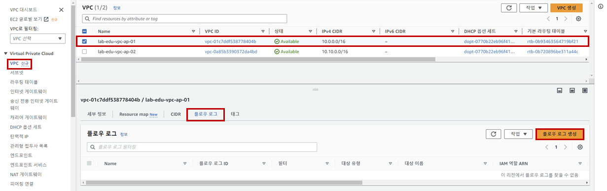
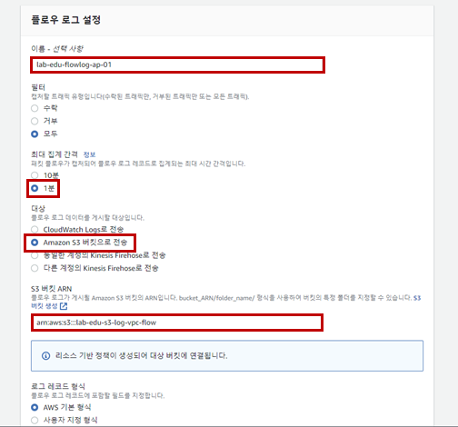

## Table of Contents
- [Table of Contents](#table-of-contents)
- [VPC Flow 로그 생성](#vpc-flow-로그-생성)
  - [1. VPC Flow Log 전용 S3 버킷 생성](#1-vpc-flow-log-전용-s3-버킷-생성)
  - [2. VPC Flow Log 생성](#2-vpc-flow-log-생성)
- [Athena 이용 로깅 데이터 검색](#athena-이용-로깅-데이터-검색)
  - [1. Athena 테이블 생성](#1-athena-테이블-생성)
  - [2. Athena 이용 로깅 데이터 검색](#2-athena-이용-로깅-데이터-검색)

## VPC Flow 로그 생성

### 1. VPC Flow Log 전용 S3 버킷 생성

- **S3 메인 콘솔 화면 → `버킷 만들기` 버튼 클릭**

- S3 버킷 생성 정보 입력

    - 이름: lab-edu-s3-log-vpc-flow-*{ACCOUNT_ID}*

    - `버킷 생성` 버튼 클릭

### 2. VPC Flow Log 생성

- **S3 메인 콘솔 화면 → `lab-edu-s3-log-vpc-flow-*{ACCOUNT_ID}*` 선택 → `속성` 탭 → `Amazon 리소스 이름(ARN)` 정보 복사**

- **VPC 메인 콘솔 화면 → `VPC` 리소스 탭 → `lab-edu-vpc-ap-01` 선택 → `플로우 로그`  탭 → `플로우 로그 생성` 버튼 클릭**

    

- Flowlog 생성 정보 입력

    - 이름: lab-edu-flowlog-ap-p1

    - 최대 집계 간격: 1분

    - 대상 정보는 `Amazon S3 버킷으로 전송` 선택

    - S3 버킷 ARN: arn:aws:s3:::{VPC_FLOW_LOG_BUCKET_NAME}

    - `플로우 로그 생성` 버튼 클릭

        

## Athena 이용 로깅 데이터 검색

### 1. Athena 테이블 생성

- 아래의 Athena 테이블 생성 코드에서 `{REGION}`, `{ACCOUNT_ID}` 항목을 실제 값으로 치환 → 내용 복사

  ```sql
  CREATE EXTERNAL TABLE IF NOT EXISTS `vpc_flow_logs` (
  version int,
  account_id string,
  interface_id string,
  ...
  flow_direction string,
  traffic_path int
  )
  PARTITIONED BY (`date` date)
  ROW FORMAT DELIMITED
  FIELDS TERMINATED BY ' '
  LOCATION 's3://lab-edu-s3-log-vpc-flow-{ACCOUNT_ID}/AWSLogs/{ACCOUNT-ID}/vpcflowlogs/{REGION}/'
  TBLPROPERTIES ("skip.header.line.count"="1");
  ```

- **Athena 메인 콘솔 화면 → `쿼리 편집기` 리소스 탭 → `쿼리` 입력 창에 SQL Query 붙여 넣기 → `실행` 버튼 클릭**

- 아래의 Partition 추가 코드에서 `{REGION}`, `{ACCOUNT_ID}` 항목을 실제 값으로 치환 → 내용 복사

    ```sql
    ALTER TABLE vpc_flow_logs
    ADD PARTITION (`date`='YYYY-MM-dd')
    LOCATION 's3://lab-edu-s3-log-vpc-flow-{ACCOUNT_ID}/AWSLogs/{ACCOUNT-ID}/vpcflowlogs/{REGION}/YYYY/MM/dd';
    ```

- **Athena 메인 콘솔 화면 → `쿼리 편집기` 리소스 탭 → `쿼리` 입력 창에 SQL Query 붙여 넣기 → `실행` 버튼 클릭**

### 2. Athena 이용 로깅 데이터 검색

- 아래의 VPC Flowlog 검색 코드에서 DATE('2020-05-04'): 오늘 일자로 변경 → 아래의 `Query` 복사

    ```sql
    SELECT * 
    FROM vpc_flow_logs 
    WHERE date = DATE('2020-05-04') 
    LIMIT 100;
    ```

- **Athena 메인 콘솔 화면 → `쿼리 편집기` 탭 → `+` 버튼 클릭 → `쿼리 3` 입력 창에 쿼리 내용 붙여 넣기 → `실행` 버튼 클릭**
