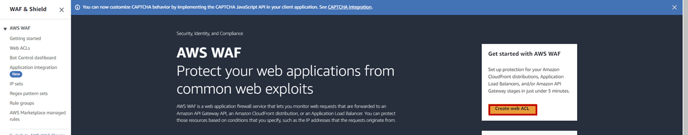
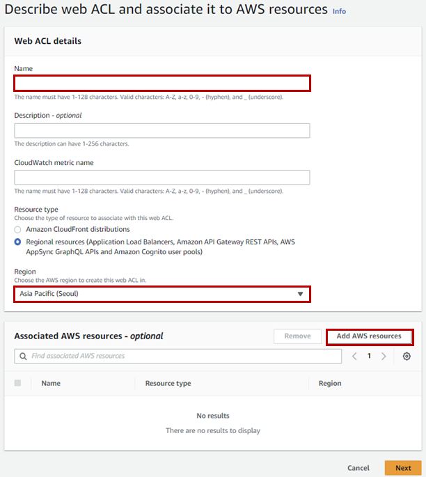
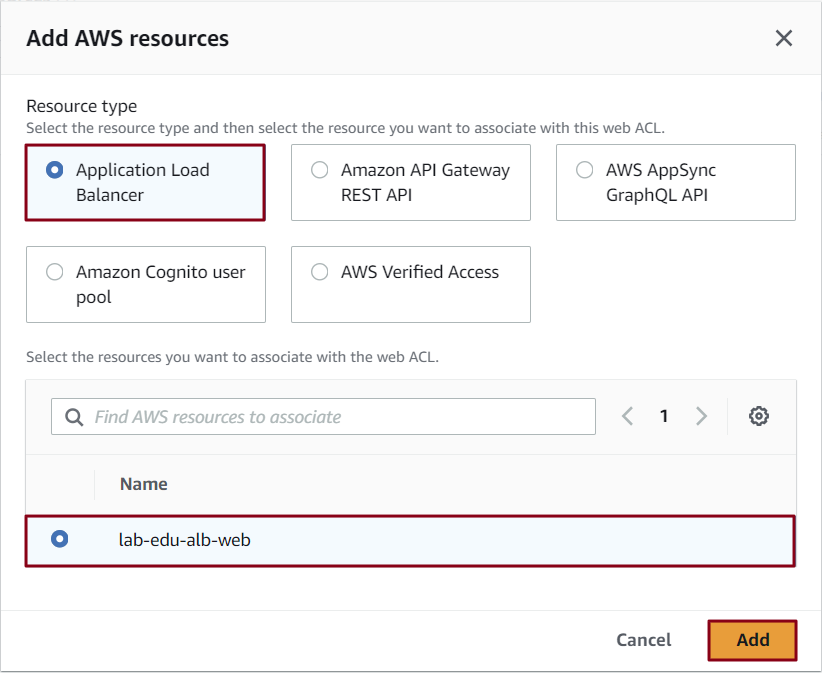
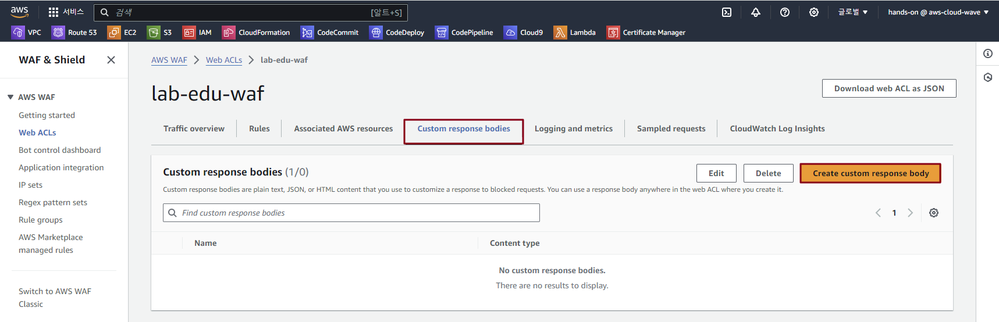
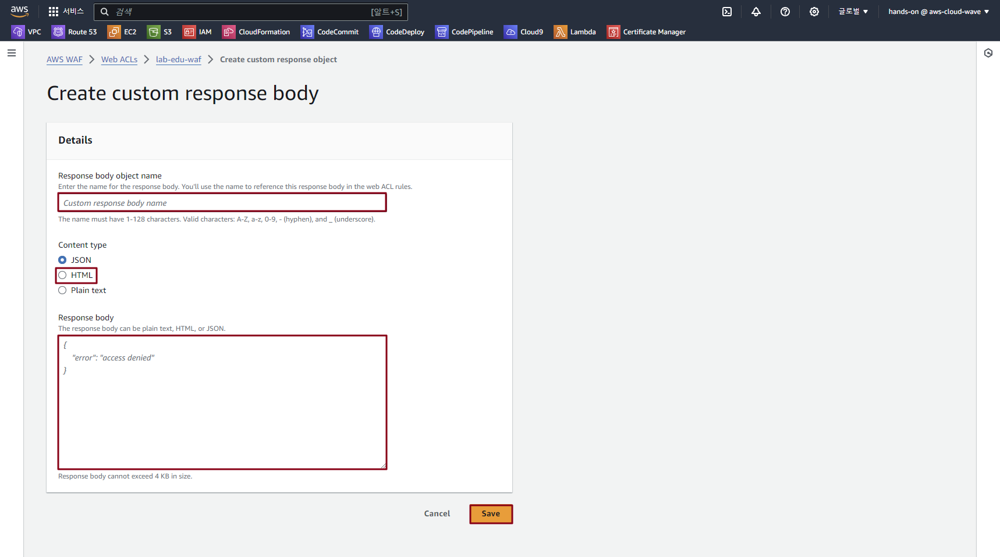

## Table of Contents
- [Table of Contents](#table-of-contents)
- [AWS WAF 생성](#aws-waf-생성)
- [Block Page 구성 (HTML)](#block-page-구성-html)
  - [1. Access Deny Web Page 구성](#1-access-deny-web-page-구성)
  - [2. Response 형식 설정](#2-response-형식-설정)

## AWS WAF 생성

- **WAF 메인 콘솔 화면 → `Create Web ACL` 버튼 클릭**

    

- WAF 생성 정보 입력

    - 이름 : lab-edu-waf

    - Region : Asia Pcific (Seoul)

    - `Add AWS resources` 버튼 클릭

        

    - `Application Load Balancer` 선택 → `lab-edu-alb-web` 체크박스 활성화 → `Add` 버튼 클릭

        
    
- `Next` 버튼 클릭 → `Next` 버튼 클릭 → `Next` 버튼 클릭 → `Create web ACL` 버튼 클릭

<br>


## Block Page 구성 (HTML)

### 1. Access Deny Web Page 구성

- VS Code 편집기 → `support_files/access_denied.html` 파일 열기 → 내용 복사

    ```html
    <!DOCTYPE html>
    <html>
    <head>
    <title>Access Denied</title>
    <style>
        body {
            background-color: #f4f4f4;
            text-align: center;
            padding: 50px;
            font-family: "Helvetica", sans-serif;
        }

        .warning {
            color: #ff0000;
            background-color: #fff;
            display: inline-block;
            padding: 20px;
            border: 1px solid #ff0000;
            box-shadow: 0 0 10px rgba(0,0,0,0.1);
        }

        h1 {
            color: #333;
        }

        p {
            color: #666;
        }
    </style>
    </head>
    <body>

    <div class="warning">
        <h1>Access Denied</h1>
        <p>Your access to this resource has been blocked by our web application firewall due to suspicious activity. If you believe this is an error, please contact the website administrator.</p>
        <p><b>Contact Information:</b></p>
        <p>Email: admin@example.com</p>
        <p>Phone: +1 123 456 7890</p>
    </div>

    </body>
    </html>
    ```

### 2. Response 형식 설정

- **WAF 메인 콘솔 화면 → `Web ACLs` 탭 → *`lab-edu-waf` 선택***

- `Custom response bodies`  탭 → `Create custom response body` 버튼 클릭

    

- Response 생성 정보 입력

    - Name : Access-Denied

    - Content type : HTML

    - Body : *access_denied.html 파일 입력*

    - 내용 저장
    
        
