## Table of Contents
- [Table of Contents](#table-of-contents)
- [IP 기반 차단 정책 생성](#ip-기반-차단-정책-생성)
  - [1. 차단 정책 생성](#1-차단-정책-생성)
  - [2. 웹 서비스 접속 테스트](#2-웹-서비스-접속-테스트)
- [해외 IP 접속 차단 설정](#해외-ip-접속-차단-설정)
  - [1. 차단 정책 생성](#1-차단-정책-생성-1)
  - [2. Default Action 수정](#2-default-action-수정)
  - [3. 웹 서비스 접속 테스트](#3-웹-서비스-접속-테스트)

## IP 기반 차단 정책 생성

### 1. 차단 정책 생성

- `https://whatismyipaddress.com/` 방문 → `IPv4` 정보 복사

    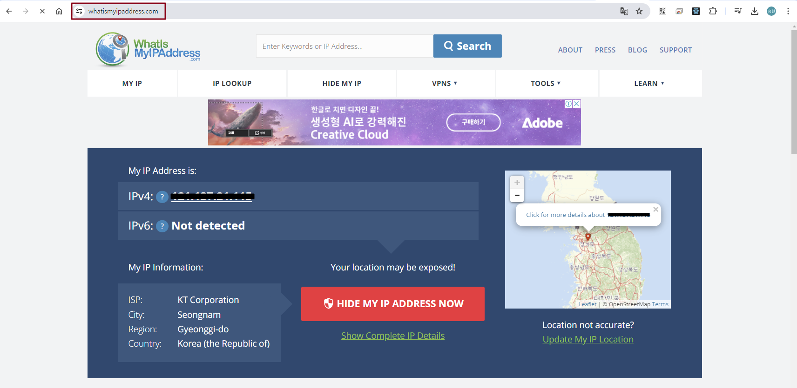

- **WAF 메인 콘솔 화면 → `IP sets` 탭 → *`Create IP set` 선택***

    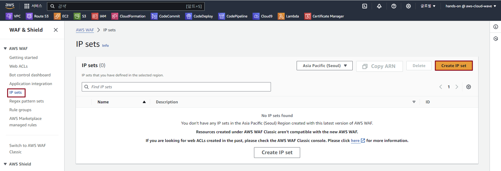

- IP set 생성 정보 입력

    - IP set name: *lab-edu-ipset-myip*

    - IP addresses: *IP_ADDRESS/32*

    - `Create IP set` 버튼 클릭

        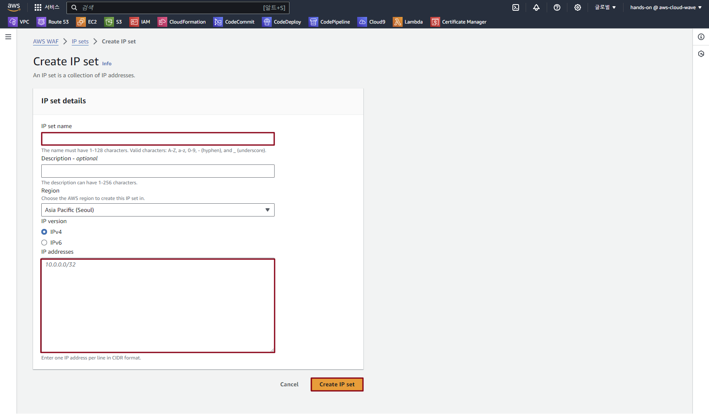

- **WAF 메인 콘솔 화면 → `Web ACLs` 탭 → *`lab-edu-waf` 선택***

- Rules 탭 → `Add Rules` 버튼 클릭 → `Add my own rules and rule groups` 선택

- Rule 생성 정보 입력

    - `IP set` 선택

    - Name: lab-edu-rule-deny-myip

    - IP set: lab-edu-ipset-myip

    - `Block` 선택

        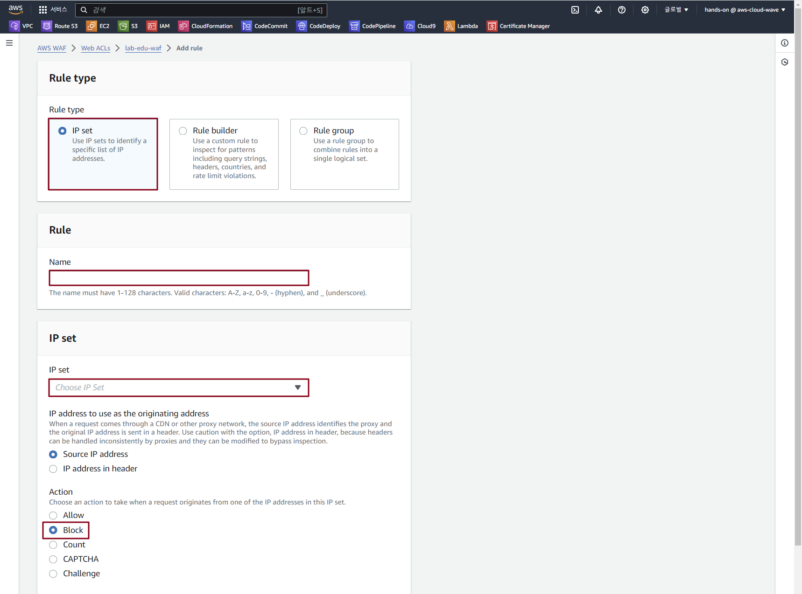

    - `Custom response - optional` 확장

    - `Enable` 체크

    - Response code: 403    

    - response body: Access-Denied

    - `Add rule` 버튼 클릭 → `Save` 버튼 클릭

        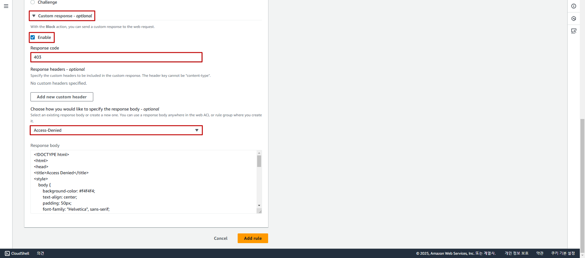

### 2. 웹 서비스 접속 테스트

- 차단된 단말기에서 웹 브라우져로 접속

    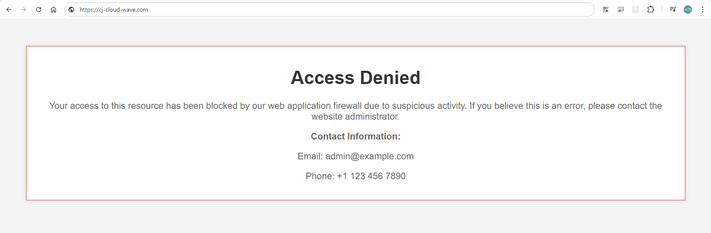

- 모바일 브라우져 이용 접속 테스트 (Wi-Fi 해제)

    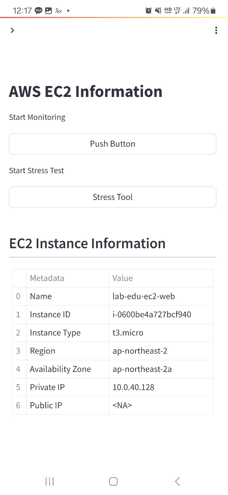

 

## 해외 IP 접속 차단 설정

### 1. 차단 정책 생성

- **WAF 메인 콘솔 화면 → `Web ACLs` 탭 → *`lab-edu-waf` 선택***

- Rules 탭 → `lab-edu-rule-deny-myip` 선택 → `Delete` 버튼 클릭

- Rules 탭 → `Add Rules` 버튼 클릭 → `Add my own rules and rule groups` 선택

- Rule 생성 정보 입력

    - `Rule builder` 선택

    - Name: lab-edu-rule-allow-korea

    - Type: Regular rule

    - Inspect: Originated from a country in

    - Country codes: Korea, Republic of - KR

    - Action: Allow

    - `Add rule` 버튼 클릭 → `Save` 버튼 클릭

        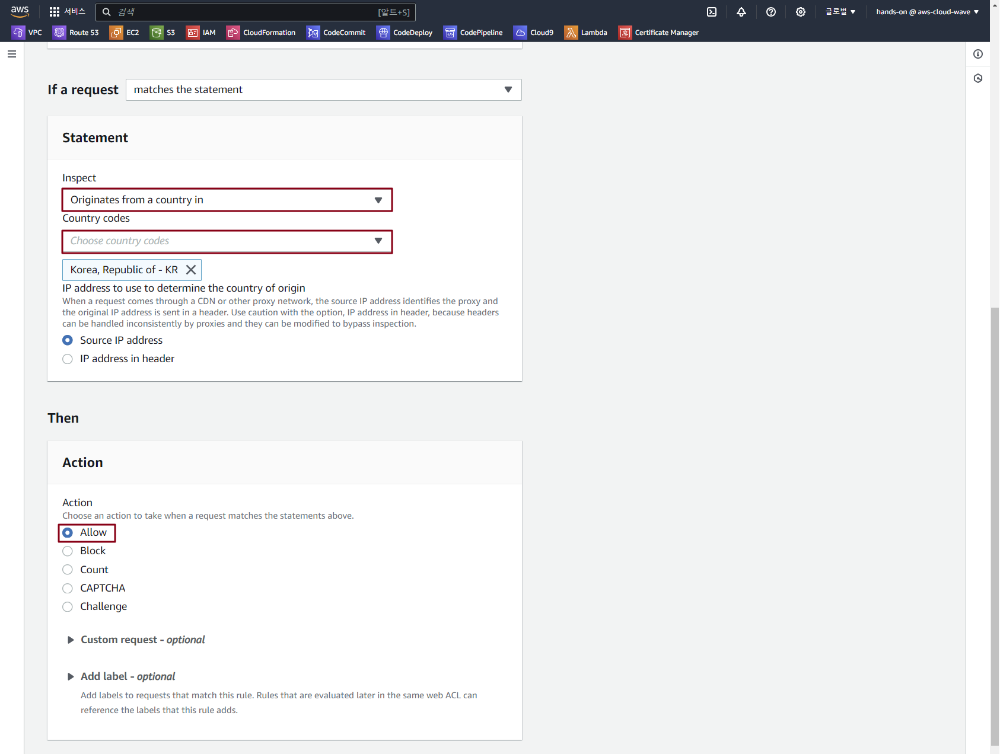

### 2. Default Action 수정

- Rules 탭 → `Default web ACL action for requests that don't match any rules` 영역 `Edit` 버튼 클릭

    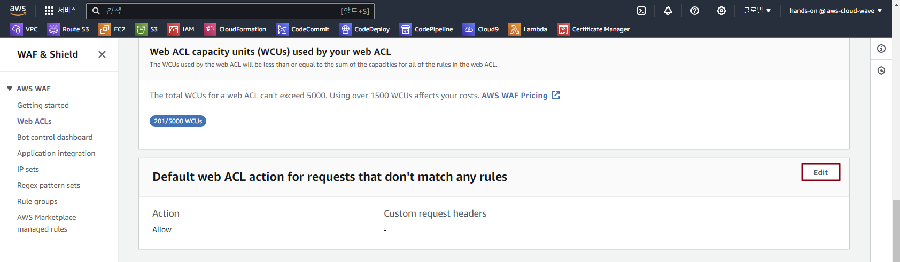

- Default web ACL action 수정 정보 입력

    - Default action: Block

    - `Custom response - optional` 확장

    - `Enable` 체크 박스 활성화

    - Response code: 403    

    - response body: Access-Denied

    - `Save` 버튼 클릭

### 3. 웹 서비스 접속 테스트

- 단말기에서 웹 브라우져로 접속

    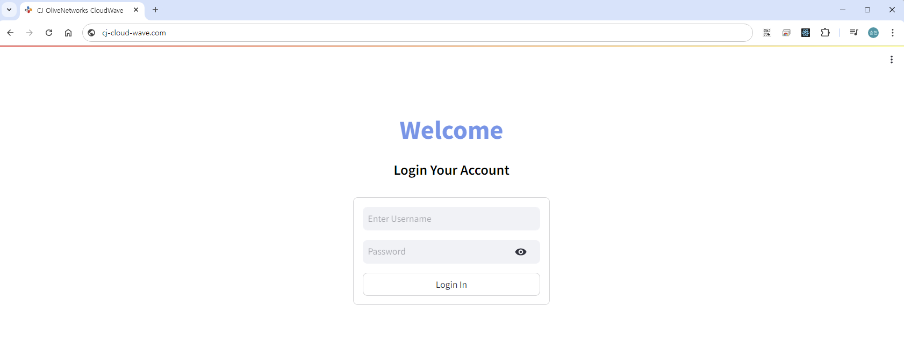

- Pingdom 사이트 접속 (https://tools.pingdom.com/)

  > Pingdom은 접속자의 위치 별로 웹사이트 접속까지 로딩 속도가 얼마나 걸리는지 테스트 할 수 있는 사이트다.

    - URL 입력: *www.{st01~30}.cj-cloud-wave.com*

    - Test From: North America - USA

    - `Start TEST` 버튼 클릭

        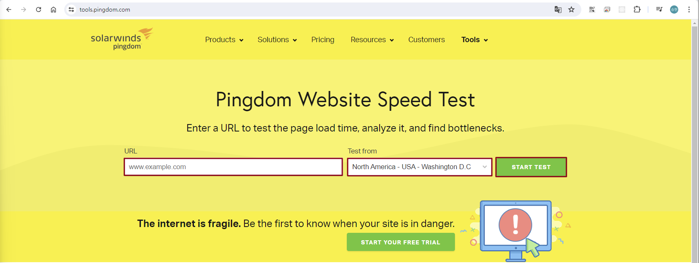

    - 테스트 결과 확인 (403 Error)

        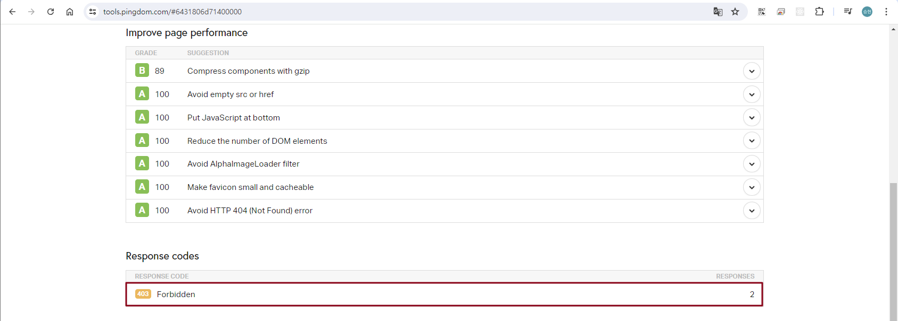
 

