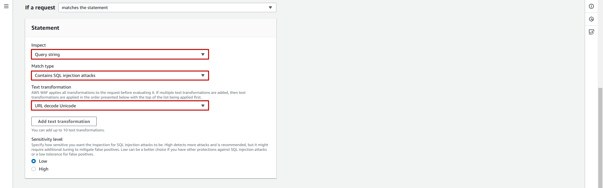

## Table of Contents
- [Table of Contents](#table-of-contents)
- [SQL Injection Attack 실습 툴 설치](#sql-injection-attack-실습-툴-설치)
  - [1. sqlmap 설치](#1-sqlmap-설치)
  - [2. sqlmap 환경 설정](#2-sqlmap-환경-설정)
  - [3. sqlmap 테스트](#3-sqlmap-테스트)
- [SQL Injection Attack 차단 설정](#sql-injection-attack-차단-설정)
  - [1. 차단 정책 생성](#1-차단-정책-생성)
  - [2. SQL Injection Attack Test](#2-sql-injection-attack-test)

## SQL Injection Attack 실습 툴 설치

`sqlmap`은 웹 애플리케이션의 SQL 주입 취약점을 자동으로 발견하기 위한 소프트웨어 유틸리티입니다. 터미널로 명령어를 입력하면서 `SQL Injection` 공격을 수행할 수 있습니다. 실제 공격을 수행이 가능한 Tool 이기 때문에 무단으로 실제 서비스 되고 있는 시스템을 대상으로 사용할 경우 불법이며 처벌의 대상이 될 수 있으니 주의해서 사용해야 합니다.

### 1. sqlmap 설치

- VS Code IDE Terminal 화면으로 이동

- Workshop 폴더로 이동

  ```bash
  cd /Workshop/
  ```

- `wget` 명령어 이용 sqlmap 설치

  ```bash
  wget https://github.com/sqlmapproject/sqlmap/tarball/master
  ```

- 다운로드 파일 압축 해제

  ```bash
  tar -zxvf master
  ```

### 2. sqlmap 환경 설정

- sqlmap command 등록

  ```bash
  echo "alias sqlmap='/usr/bin/python3 /Workshop/sqlmapproject-sqlmap-0f9a1c8/sqlmap.py'" | sudo tee -a /etc/bashrc
  ```

- shell 설정 적용

  ```bash
  source /etc/bashrc 
  ```

### 3. sqlmap 테스트

- 웹 서비스 공격 테스트

  ```bash
  sqlmap -u "https://cj-cloud-wave.com/"
  ```

  ```bash
         ___
        __H__
  ___ ___["]_____ ___ ___  {1.9.1.2#dev}
  |_ -| . ["]     | .'| . |
  |___|_  [,]_|_|_|__,|  _|
        |_|V...       |_|   https://sqlmap.org

  [!] legal disclaimer: Usage of sqlmap for attacking targets without prior mutual consent is illegal. It is the end user's responsibility to obey all applicable local, state and federal laws. Developers assume no liability and are not responsible for any misuse or damage caused by this program

  [*] starting @ 08:20:08 /2025-01-13/

  [08:20:09] [INFO] testing connection to the target URL
  [08:20:09] [CRITICAL] previous heuristics detected that the target is protected by some kind of WAF/IPS
  [08:20:09] [INFO] testing if the target URL content is stable
  [08:20:09] [INFO] target URL content is stable
  [08:20:09] [CRITICAL] no parameter(s) found for testing in the provided data (e.g. GET parameter 'id' in 'www.site.com/index.php?id=1')
  ```

<br>


## SQL Injection Attack 차단 설정

### 1. 차단 정책 생성

- **WAF 메인 콘솔 화면 → `Web ACLs` 탭 → *`lab-edu-waf` 선택***

- Rules 탭 → `Add Rules` 버튼 클릭 → `Add my own rules and rule groups` 선택

- Rule 생성 정보 입력

    - `Rule builder` 선택

    - Name: lab-edu-rule-sql-injection

    - Type: Regular rule

    - If a request : matches the statement

    - Inspect: query string

    - Match type : Contains SQL injection attacks

    - Text transformation : URL decode Unicode

      

    - `Custom response - optional` 확장

    - `Enable` 체크

    - Response code: 403    

    - response body: Access-Denied

    - `Add rule` 버튼 클릭 → `Save` 버튼 클릭

### 2. SQL Injection Attack Test

- 웹 서비스 공격 테스트

  ```bash
  sqlmap -u "https://cj-cloud-wave.com/"
  ```


