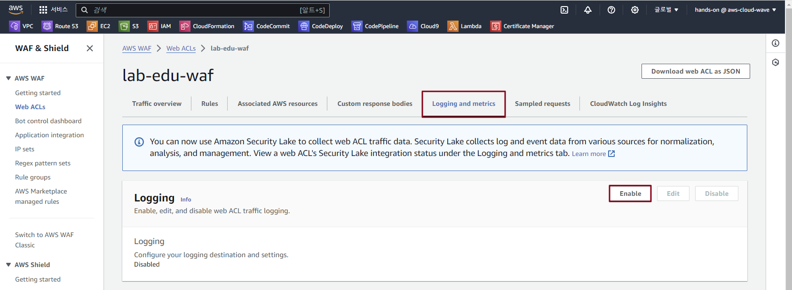
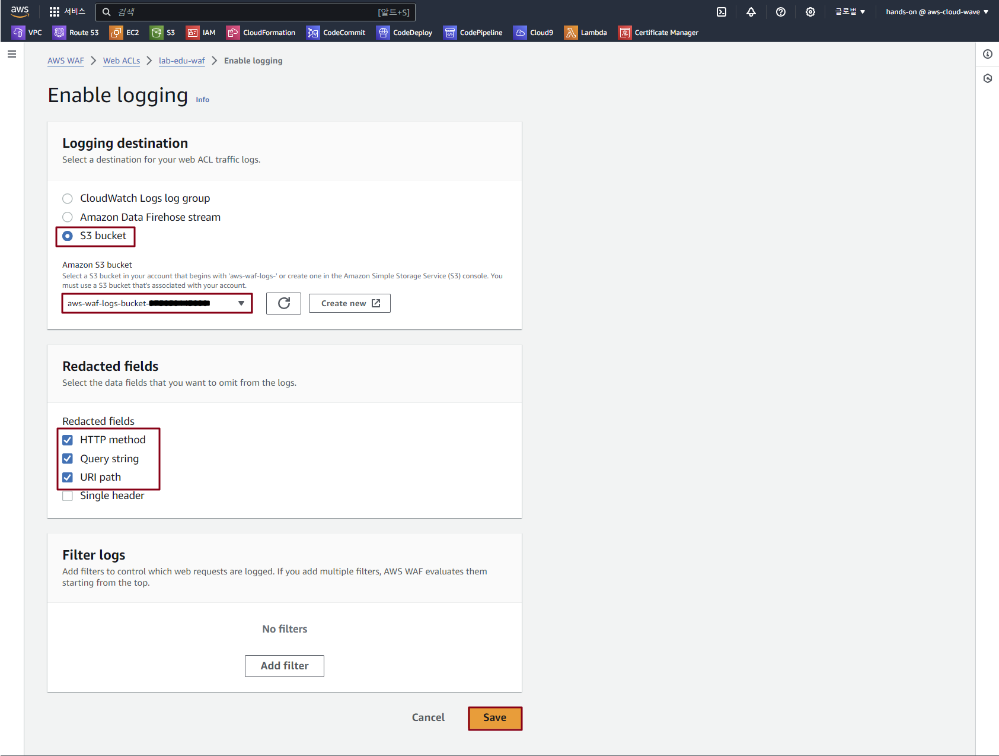

## Table of Contents
- [Table of Contents](#table-of-contents)
- [WAF Logging 설정](#waf-logging-설정)
  - [1. WAF Logging 용 버킷 S3 생성](#1-waf-logging-용-버킷-s3-생성)
  - [2. WAF Logging 설정](#2-waf-logging-설정)

## WAF Logging 설정

### 1. WAF Logging 용 버킷 S3 생성

- **S3 콘솔 메인 화면 → `버킷 만들기` 버튼 클릭**

- S3 버킷 생성 정보 입력

    - 버킷 이름: *aw-waf-logs-bucket-{ACCOUNT_ID}*

    - `버킷 생성` 버튼 클릭

### 2. WAF Logging 설정

- **WAF 메인 콘솔 화면 → `Web ACLs` 탭 → *`lab-edu-waf` 선택***

- Logging and metrics 탭 → `Logging` 항목의 `Enable` 버튼 클릭

    

- Logging 설정 정보 입력

    - Logging destination: S3 bucket

    - Amazon S3 bucket: aws-waf-logs-bucket

    - Redacted fields: HTTP method, Query string, URI path

    - `Save` 버튼 클릭

        