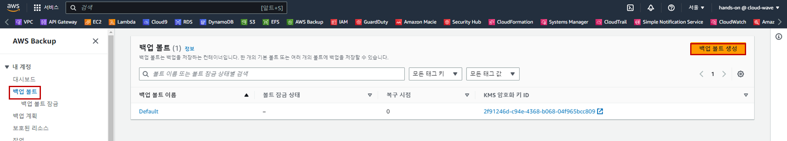
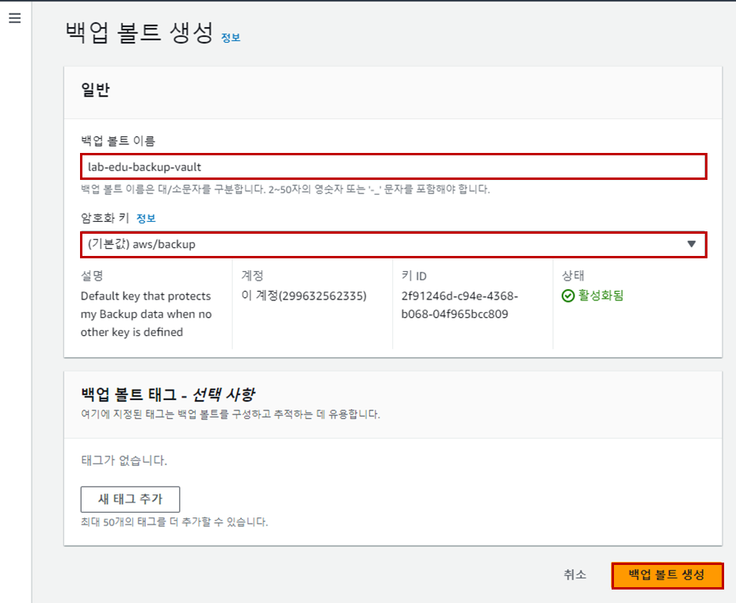
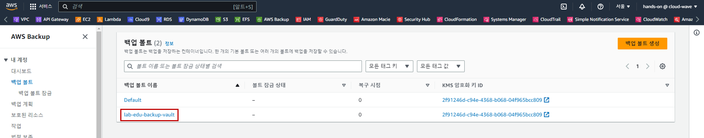
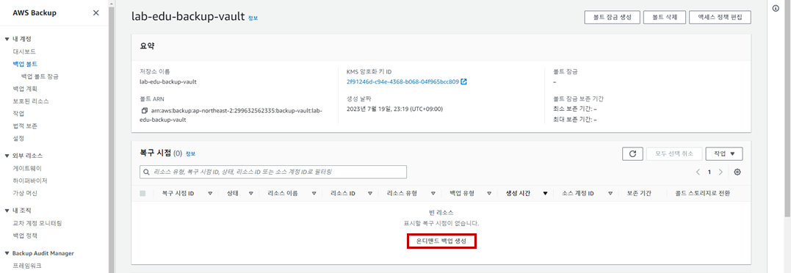
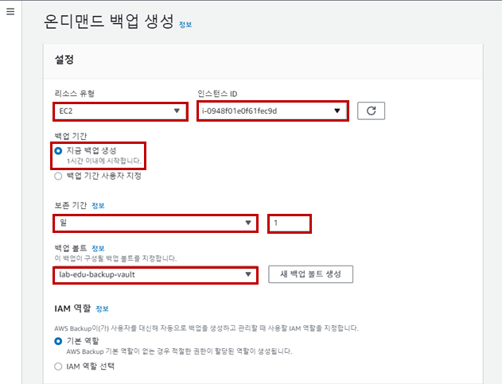
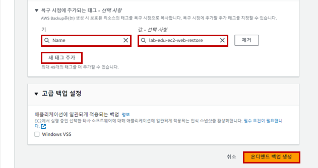
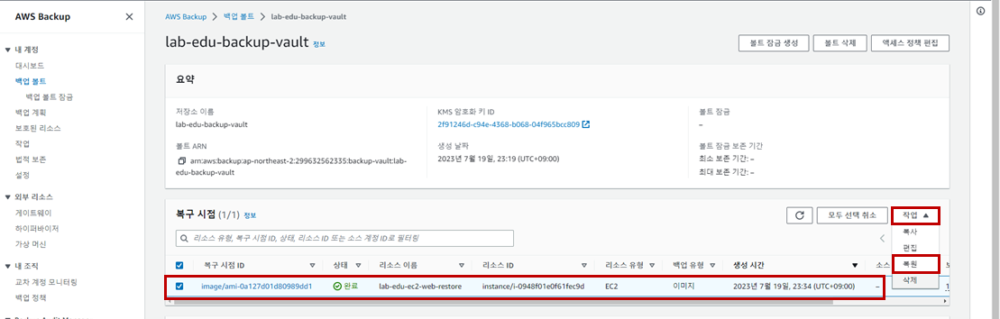
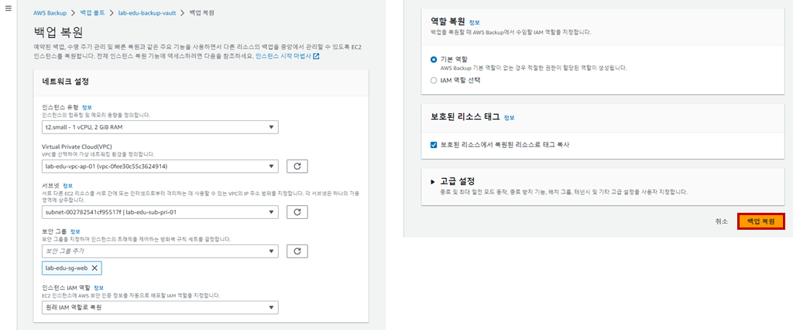

## Table of Contents
- [Table of Contents](#table-of-contents)
- [AWS Backup 온디맨드 방식](#aws-backup-온디맨드-방식)
  - [1. Backup Vault 생성](#1-backup-vault-생성)
  - [2. 온디맨드 백업 생성](#2-온디맨드-백업-생성)
  - [3. 백업 파일 이용 서버 복원](#3-백업-파일-이용-서버-복원)

## AWS Backup 온디맨드 방식

### 1. Backup Vault 생성

- **Backup 메인 콘솔 화면 → `볼트` 리소스 탭 → `백업 볼트 생성` 버튼 클릭**

    

- Backup Vault 생성 정보 입력

    - 백업 볼트 이름: lab-edu-backup-vault

    - 암호화 키: (기본값) aws/backup

    - `백업 볼트 생성` 버튼 클릭

        

### 2. 온디맨드 백업 생성

- **Backup 메인 콘솔 화면 → `볼트` 리소스 탭 → *`lab-edu-backup-vault`* 선택**

    

- `온디맨드 백업 생성` 버튼 클릭

    

- 온디맨드 백업 생성 정보 입력

    - 리소스 유형: EC2

    - 인스턴스 ID: lab-edu-ec2-web

    - 백업 기간: 지금 백업 생성

    - 보존 기간: 일/1

    - 백업 볼트: lab-edu-backup-vault

        

    - `새 태그 추가` 버튼 클릭

    - 키: Name

    - 값: lab-edu-ec2-web-restore

    - `백업 볼트 생성` 버튼 클릭

        

### 3. 백업 파일 이용 서버 복원

- **Backup 메인 콘솔 화면 → `볼트` 리소스 탭 → *`lab-edu-backup-vault`* 선택**

- *`lab-edu-ec2-web-restore`* 선택 → `작업` 버튼 클릭 → `복원` 버튼 클릭

    

- `백업 복원` 버튼 클릭

    
 