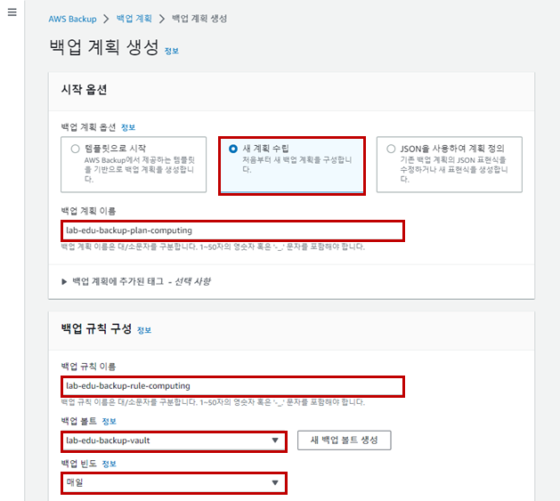
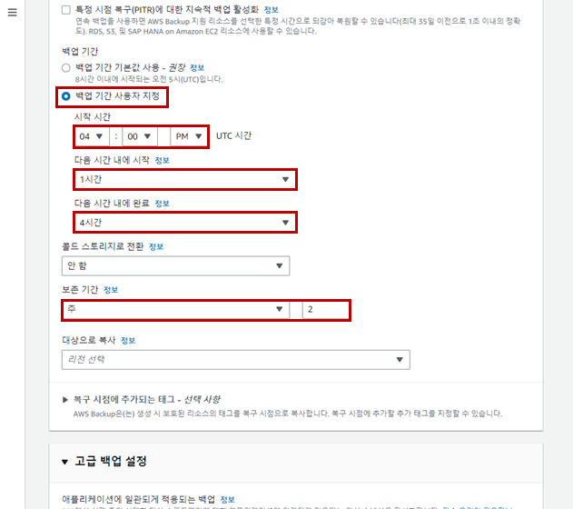
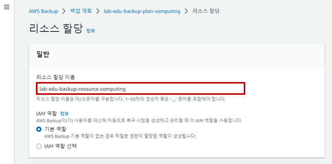
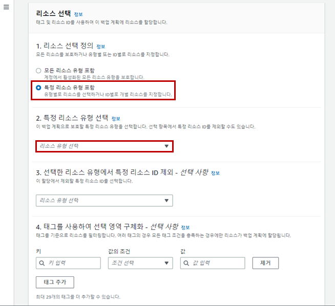

## Table of Contents
- [Table of Contents](#table-of-contents)
- [AWS Backup Plan 방식](#aws-backup-plan-방식)
  - [1. 백업 계획 생성](#1-백업-계획-생성)
  - [2. 백업 리소스 생성](#2-백업-리소스-생성)

## AWS Backup Plan 방식

### 1. 백업 계획 생성

- **Backup 메인 콘솔 화면 → `백업 계획` 리소스 탭 → `백업 계획 생성` 버튼 클릭**

- 백업 계획 생성 정보 입력

    - 백업 계획 옵션 : 새 계획 수립

    - 백업 계획 이름 : lab-edu-backup-plan-computing

    - 백업 규칙 이름 : lab-edu-backup-rule-computing

    - 백업 볼트 : lab-edu-backup-vault

    - 백업 빈도 : 매일

        

    - 백업 기간 : 백업 기간 사용자 지정

    - 시작 시간 : 04:00 PM (한국 시간으로 오전 1시)

    - 다음 시간 내에 시작 : 1시간

    - 다음 시간 내에 완료 : 4시간

    - 보존 기간 : 2

    - `백업 계획 생성` 버튼 클릭

        

### 2. 백업 리소스 생성

- 백업 리소스 생성 정보 입력

    - 리소스 할당 이름 : lab-edu-backup-resource-computing

        

    - 리소스 선택 정의 : 특정 리소스 유형 포함

    - 특정 리소스 유형 선택 : EC2

    - 리소스 유형 : EC2

    - 인스턴스 ID : 모든 인스턴스

    - `리소스 할당` 버튼 클릭

        

